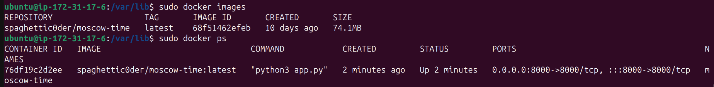
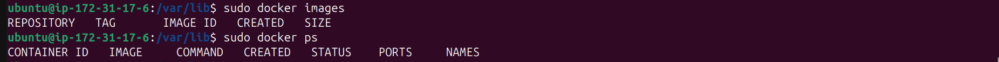
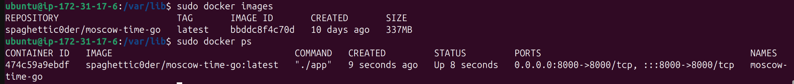
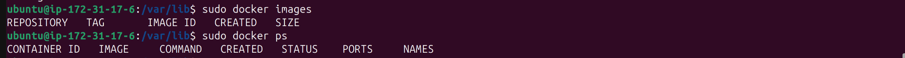

# Ansible Deployment Documentation

## Playbook Execution

after setting up the defaults/main.yml file, let's run the playbooks and observe the output and check the instance after each run

### Deploy app_python

to run the playbook, we use:

```bash
ansible-playbook playbooks/dev/app_python//main.yml
```

after executing the previous line, we get:

```bash
PLAY [all] *****************************************************************************************************************

TASK [Gathering Facts] *****************************************************************************************************
ok: [aws_instance]

TASK [web_app : Pull Docker image] *****************************************************************************************
changed: [aws_instance]

TASK [web_app : Create Application Directory] ******************************************************************************
changed: [aws_instance]

TASK [web_app : Deploy Docker Compose File] ********************************************************************************
changed: [aws_instance]

TASK [web_app : Start Docker Compose] **************************************************************************************
changed: [aws_instance]

TASK [web_app : Stop the running container] ********************************************************************************
skipping: [aws_instance]

TASK [web_app : Remove the container] **************************************************************************************
skipping: [aws_instance]

TASK [web_app : Get image details] *****************************************************************************************
skipping: [aws_instance]

TASK [web_app : Remove the Docker image] ***********************************************************************************
skipping: [aws_instance]

PLAY RECAP *****************************************************************************************************************
aws_instance               : ok=5    changed=4    unreachable=0    failed=0    skipped=4    rescued=0    ignored=0 
```

- let's check:
- 

### Wipe app_python

to run the playbook, we set the `wipe_image:true` in the defaults file and then we use:

```bash
ansible-playbook playbooks/dev/app_python//main.yml --tags wipe
```

after executing the previous line, we get:

```bash
PLAY [all] *****************************************************************************************************************

TASK [Gathering Facts] *****************************************************************************************************
ok: [aws_instance]

TASK [web_app : Stop the running container] ********************************************************************************
changed: [aws_instance]

TASK [web_app : Remove the container] **************************************************************************************
changed: [aws_instance]

TASK [web_app : Get image details] *****************************************************************************************
ok: [aws_instance]

TASK [web_app : Remove the Docker image] ***********************************************************************************
changed: [aws_instance]

PLAY RECAP *****************************************************************************************************************
aws_instance               : ok=5    changed=3    unreachable=0    failed=0    skipped=0    rescued=0    ignored=0 
```

- let's check:
- 

### Deploy app_go

to run the playbook, we use:

```bash
ansible-playbook playbooks/dev/app_go//main.yml
```

after executing the previous line, we get:

```bash
PLAY [all] *****************************************************************************************************************

TASK [Gathering Facts] *****************************************************************************************************
ok: [aws_instance]

TASK [web_app_go : Pull Docker image] **************************************************************************************
changed: [aws_instance]

TASK [web_app_go : Create Application Directory] ***************************************************************************
ok: [aws_instance]

TASK [web_app_go : Deploy Docker Compose File] *****************************************************************************
ok: [aws_instance]

TASK [web_app_go : Start Docker Compose] ***********************************************************************************
changed: [aws_instance]

TASK [web_app_go : Stop the running container] *****************************************************************************
skipping: [aws_instance]

TASK [web_app_go : Remove the container] ***********************************************************************************
skipping: [aws_instance]

TASK [web_app_go : Get image details] **************************************************************************************
skipping: [aws_instance]

TASK [web_app_go : Remove the Docker image] ********************************************************************************
skipping: [aws_instance]

PLAY RECAP *****************************************************************************************************************
aws_instance               : ok=5    changed=2    unreachable=0    failed=0    skipped=4    rescued=0    ignored=0 
```

- let's check:
- 

### Wipe app_python

to run the playbook, we set the `wipe_image:true` in the defaults file and then we use:

```bash
ansible-playbook playbooks/dev/app_go//main.yml --tags wipe
```

after executing the previous line, we get:

```bash
PLAY [all] *****************************************************************************************************************

TASK [Gathering Facts] *****************************************************************************************************
ok: [aws_instance]

TASK [web_app_go : Stop the running container] *****************************************************************************
changed: [aws_instance]

TASK [web_app_go : Remove the container] ***********************************************************************************
changed: [aws_instance]

TASK [web_app_go : Get image details] **************************************************************************************
ok: [aws_instance]

TASK [web_app_go : Remove the Docker image] ********************************************************************************
changed: [aws_instance]

PLAY RECAP *****************************************************************************************************************
aws_instance               : ok=5    changed=3    unreachable=0    failed=0    skipped=0    rescued=0    ignored=0  
```

- let's check:
- 
