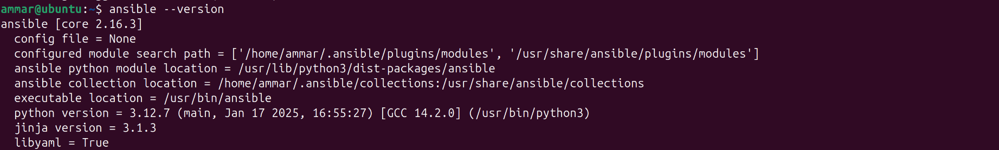
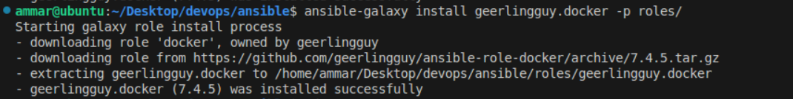
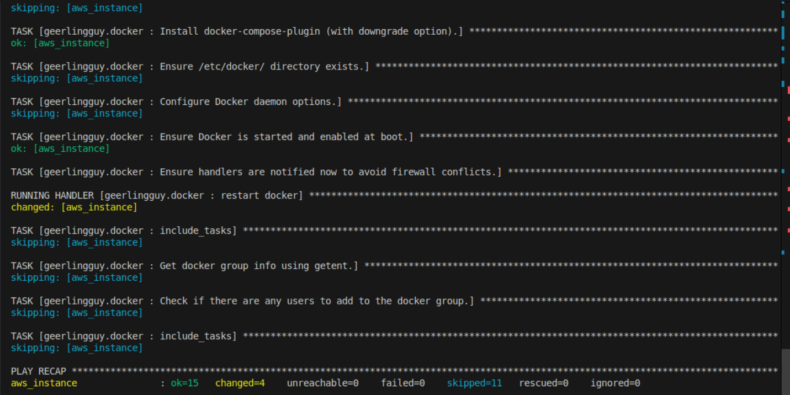
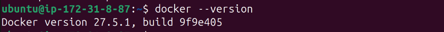
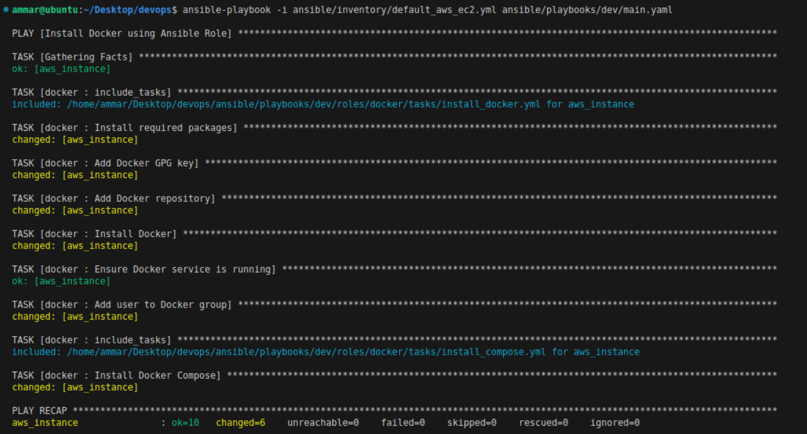
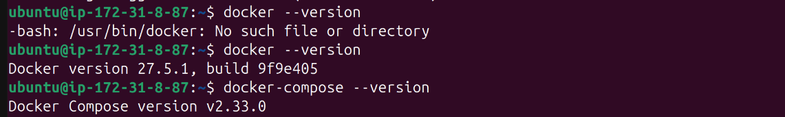

# Lab 5: Ansible

- let's first install ansible and check that it got installed correctly:
- 
- then let's install a docker role from ansible galaxy:
- 
- let's create an aws instance and add it to inventory so it will be added to the hosts, and then let's run the playbook
- 
- the playbook has been executed successfully:
- 
- let's ssh into the instance and check docker version:
- 
- let's create our own roles to install docker and docker-compose and run the new playbook:
- 
- let's check docker and docker-compose versions on our instance after deleting the ones we installed from the first playbook:
- 
- after deleting docker and docker-compose from the instance, and installing aws on the local machine and configure the connection to aws cloud and creating ``aws_ec2.yml`` file, and run the playbook, we check the instance and get the same docker and docker-compose versions
