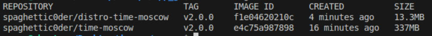

# Dockerfile Best Practices Explained

This document highlights the best practices followed in the `Dockerfile` for the `app_go` project, which builds a container image for a Go web application. The Dockerfile was crafted following [Docker's best practices](https://docs.docker.com/build/building/best-practices/), with additional insights from the Hadolint linter for validation.

## 1. Choosing the Right Base Image
    ```
    FROM golang:1.23-alpine
    ```
We chose golang:1.23-alpine as the base image. This image is based on Alpine Linux, a lightweight distribution that minimizes the overall size of the container image. Alpine images are a great choice for production environments, reducing attack surface and improving security.

## 2. Efficient Layering
We ensure that each instruction in the Dockerfile adds only necessary changes to the image layers. This reduces the overall size and complexity of the final image. Layers are cached in Docker, so this organization makes sure that steps are efficiently executed.

## 3. Minimal Copy Instructions
Instead of using a single ```COPY . .``` command, we copy only the necessary files individually. This ensures that only the files needed for the application are included in the image, preventing unnecessary files from being added to the image.

## 4. Exposing the Correct Port
    ```
    EXPOSE 8000
    ```
We use the ```EXPOSE``` directive to specify that the application will listen on port 8000, which matches the configuration in the main Flask app code. 

## 5. Hadolint for Dockerfile Linting

We used Hadolint to organize and clean up the Dockerfile by identifying inefficiencies and enforcing best practices. It ensured proper layer management, optimized commands, and minimized unnecessary dependencies, resulting in a leaner and more maintainable Dockerfile.

# The Difference Between The Distroless Image and The Previous Image

## The Previous Image
A Go base image was used and the whole Dockerfile consisted of one stage where it was needed to install some extra packages and then compile and run the app.

## The Distroless Image
The Dockerfile consisted of 2 stages, where in the first stage a Go base image was used to install the packages, while the second stage a distroless Go image waas used and it copied the compiled app and the html file from the previous stage which helped to decrease the size of the final docker image. Moreover, a nonroot distroless Go base image was used .

