# Lab 11: Kubernetes Secrets and Hashicorp Vault

## Task 1:

- let's reconnect to the same instance that we have created for the previous 2 labs
- let's create a sectret using `kubectl`:
- 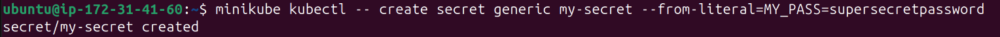
- let's verify that the secret has been created:
- 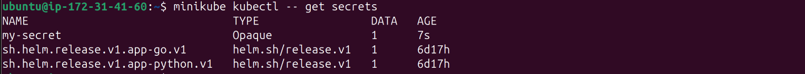
- let's get the details of the secret by executing `minikube kubectl -- get secret my-secret -o yaml`:

  ```
  apiVersion: v1
  data:
    MY_PASS: c3VwZXJzZWNyZXRwYXNzd29yZA==
  kind: Secret
  metadata:
    creationTimestamp: "2025-03-05T20:29:46Z"
    name: my-secret
    namespace: default
    resourceVersion: "19321"
    uid: 91f048bf-82a7-4a1a-93f8-90f74b6b0cf8
  type: Opaque


  ```
- let's decode the secret value:
- 
- video
- let's install `secrets` plugin for `helm`
- 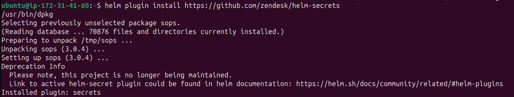
- let's check that it got installed:
- 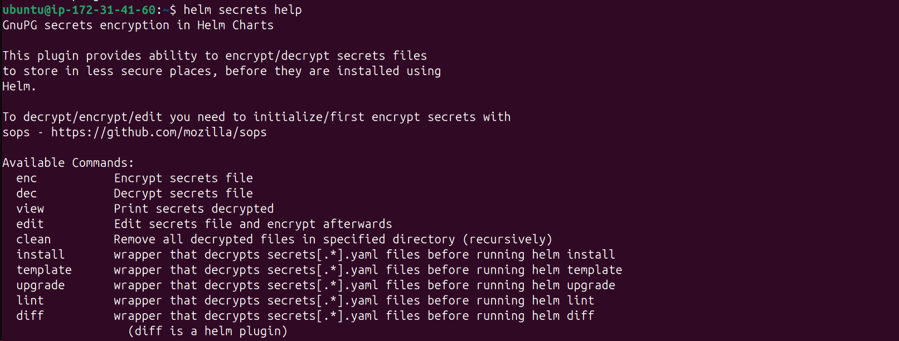
- let's create a key using `gpg` and check that it got added to the keys list
- 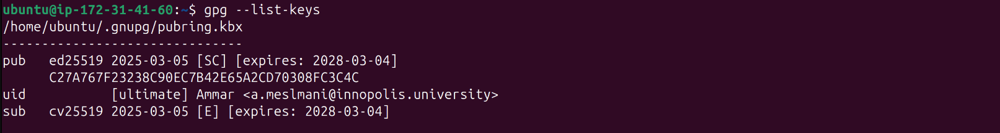
- let's create `secrets.yaml` by executing

  ```
  sosp C27A767F23238C90EC7B42E65A2CD70308FC3C4C secrets.yaml
  ```
- and let's write inside it the following:

  ```
  password: secret1234
  ```
- let's check `secrets.yaml` by executing `cat secrets.yaml`:

  ```
  password: ENC[AES256_GCM,data:oIyVQRFPlCjNMw==,iv:5R0sr42n6WSoR+9hZ0oFC3VTKVSw/x/AJU9qoM96PWw=,tag:3wkScxYNiJL9B1zo9NMcyA==,type:str]
  sops:
      kms: []
      gcp_kms: []
      lastmodified: '2025-03-05T22:08:34Z'
      mac: ENC[AES256_GCM,data:77u0BiDrhLcywkPSgK7+t9CrxoFNAUrsGKARtpaj1Vd7lJ5aXKv0i01hsECDWfQ+BC1FsD/aFglyQGR0YXJquujTUrqwFeYaRduq4bwswzGKo6mPUUi/zmiQ5+YJ+FKdkMWxbZ5Y4mNWFDN9btYm+IOg5LJGfmxe4Tv1p3dLKvg=,iv:aibIP5R9filxWDRQb4IrQGyedtKwQk/i7XCzYIHU9QY=,tag:4uZ0Y1MttfQXw4MOZVQq+A==,type:str]
      pgp:
      -   created_at: '2025-03-05T22:07:38Z'
          enc: |
              -----BEGIN PGP MESSAGE-----

              hF4Dwup2HkqkFM8SAQdAGCHY6wZwDjjpKrhx9QJ2JHS6FhDxI+oRWnBI83t1sBEw
              SoNkgbisGlnH4pScD1irWE0v4Uo1YzsaU/FjYkSdRzOiEBl5DztHGIvx6J83vsz+
              1GgBCQIQMyzycZDtpzK92jjLhF7aq/dBWhT3tyNzLgtaW+2Rig+k4l9PT93h0vOp
              /InOXHNwCkqBFToZ1LK02LbVzvRpkM7YtGjj1n+Nj2T4hvF+QCxpgtB1ESO5uZyN
              pdGHFQC1eOCCHg==
              =Y5CF
              -----END PGP MESSAGE-----
          fp: C27A767F23238C90EC7B42E65A2CD70308FC3C4C
      unencrypted_suffix: _unencrypted
      version: 3.0.3
  ```
- let's decode the secret:
- 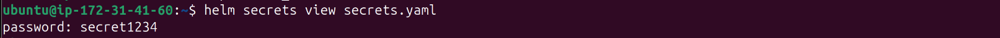
- let's add `secrets.yaml` file to `/helm/app-python/templates/`:

  ```
  apiVersion: v1
  kind: Secret
  metadata:
    name: credentials
    labels:
      app: app-python
      chart: '{{ .Chart.Name }}-{{ .Chart.Version }}'
      release: '{{ .Release.Name }}'
      heritage: '{{ .Release.Service }}'
  type: Opaque
  data:
    password: {{ .Values.password | b64enc | quote }}
  ```
- let's update `deployment.yaml` file in `/helm/app-python/` by adding the following lines under `spec.template.spec.containers`:

  ```
  env:
  - name: MY_PASSWORD
    valueFrom:
      secretKeyRef:
        name: credentials
        key: password
  ```
- let's uninstall the previous `app-python` and reinstall it again using the secret:
- 
- 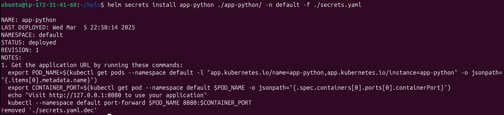
- let's check that it got installed
- 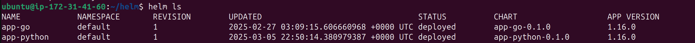
- let's retrieve the list of pods:
- 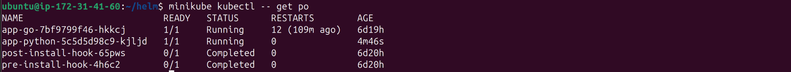
- we can see that the pod name is `app-python-5c5d5d98c9-kjljd`
- let's verify the secret inside the pod:
- 
- we can see that it matches the password that we have selected earlier

## Task 2:

- let's install the `vault helm chart` and check that it got installed:
- 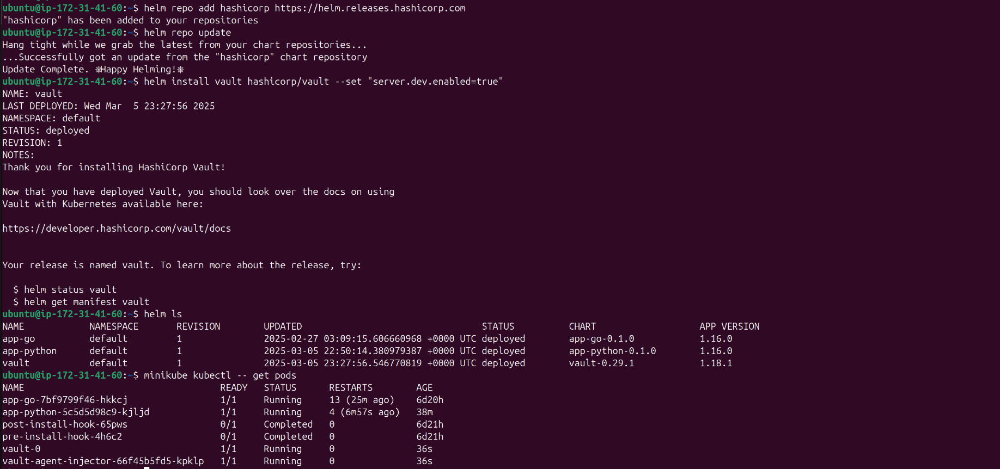
- let's start an interactive shell session on the `vault-0` pod and enable kv-v2 secrets at the path `internal`:
- 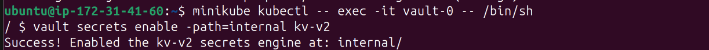
- now let's set a secret by executing `vault kv put internal/app-python/config username="ammar" password="secret1234"` and then let's verify that we can read that secret at the path ``internal/app-python/config``:
- 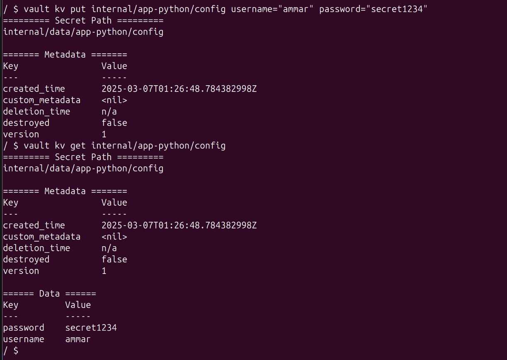
- now let's enable the Kubernetes authentication method and configure the Kubernetes authentication method to use the location of the Kubernetes API:
- 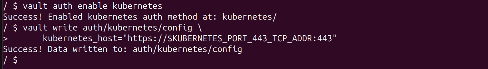
- now let's write out the policy named `internal-app` that enables the `read` capability for secrets at path `internal/app-python/config`:

  ```
  $ vault policy write internal-app - <<EOF
  path "`internal/app-python/config`" {
     capabilities = ["read"]
  }
  EOF
  ```
- and we get the output:

  ```
  Success! Uploaded policy: internal-app
  ```
- now let's create a Kubernetes authentication role named `internal-app`:

  ```
  vault write auth/kubernetes/role/internal-app \
        bound_service_account_names=internal-app \
        bound_service_account_namespaces=default \
        policies=internal-app \
        ttl=24h
  ```
- and we get the output:

  ```
  Success! Data written to: auth/kubernetes/role/internal-app
  ```
- as we used `helm create` for our chart, `serviceaccount.yaml` was automatically created
- values
- let's create `patch-inject-secrets.yaml`:

  ```
  spec:
    template:
      metadata:
        annotations:
          vault.hashicorp.com/agent-inject: 'true'
          vault.hashicorp.com/role: 'internal-app'
          vault.hashicorp.com/agent-inject-secret-config.txt: 'internal/app-python/config'
  ```
- let's patch `app-python` by executing `minikube kubectl -- patch deployment app-python --patch "$(cat patch-inject-secrets.yaml)"`

  ```
  deployment.apps/app-python patched
  ```
- let's check that vault has been patched successfully by executing `kubectl exec -it app-python-86dd4c657-q7hnp --container app-python -- /bin/sh`:

  ```
  /app # ls
  app.py     templates
  /app # cd ..
  / # ls
  app    bin    dev    etc    home   lib    media  mnt    opt    proc   root   run    sbin   srv    sys    tmp    usr    var    vault
  / # cat vault/secrets/database-config.txt
  data: map[password:db-secret-password username:db-readonly-username]
  metadata: map[created_time:2025-03-08T01:52:17.979967252Z custom_metadata:<nil> deletion_time: destroyed:false version:1]
  / # 
  / # df -h
  Filesystem                Size      Used Available Use% Mounted on
  overlay                  47.4G      7.7G     39.7G  16% /
  tmpfs                    64.0M         0     64.0M   0% /dev
  shm                      64.0M         0     64.0M   0% /dev/shm
  /dev/root                47.4G      7.7G     39.7G  16% /dev/termination-log
  tmpfs                     7.8G      4.0K      7.8G   0% /vault/secrets
  /dev/root                47.4G      7.7G     39.7G  16% /etc/resolv.conf
  /dev/root                47.4G      7.7G     39.7G  16% /etc/hostname
  /dev/root                47.4G      7.7G     39.7G  16% /etc/hosts
  tmpfs                     7.8G     12.0K      7.8G   0% /run/secrets/kubernetes.io/serviceaccount
  tmpfs                     3.9G         0      3.9G   0% /proc/acpi
  tmpfs                    64.0M         0     64.0M   0% /proc/kcore
  tmpfs                    64.0M         0     64.0M   0% /proc/keys
  tmpfs                    64.0M         0     64.0M   0% /proc/latency_stats
  tmpfs                    64.0M         0     64.0M   0% /proc/timer_list
  tmpfs                     3.9G         0      3.9G   0% /proc/scsi
  tmpfs                     3.9G         0      3.9G   0% /sys/firmware
  ```

## Bonus:

- let's update `values.yaml` by adding for both charts:

  ```
  resources:
    requests:
      cpu: "250m"
      memory: "128Mi"
    limits:
      cpu: "500m"
      memory: "256Mi"
  ```
- let's verify resource settings for `app-python` and `app-go`:
- 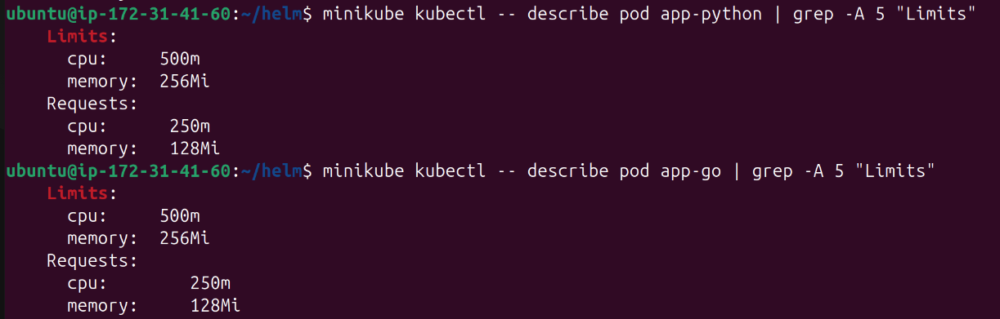
- let's add the following to `_helpers.tpl`:

  - app-python:

    ```
    {{/*
    Define environment variables for the app.
    */}}
    {{- define "app-python.envVars" -}}
    {{- range $key, $value := .Values.env }}
    - name: {{ $key }}
      value: {{ $value | quote }}
    {{- end }}
    {{- end }}
    ```
  - app-go:

    ```
    {{/*
    Define environment variables for the app.
    */}}
    {{- define "app-go.envVars" -}}
    {{- range $key, $value := .Values.env }}
    - name: {{ $key }}
      value: {{ $value | quote }}
    {{- end }}
    {{- end }}
    ```
- let's modify `env` section in `deployment.yaml`:
- - app-python:
    ```
    env:
      {{- include "app-python.envVars" . | nindent 12 }}
    ```
- - app-go:
    ```
    env:
      {{- include "app-go.envVars" . | nindent 12 }}
    ```
- let's add environment variables to `values.yaml` for both charts:

  ```
  env:
    APP_ENV: "production"
    DEBUG: "false"
  ```
- and that's how environment variables got moved to the `_helpers.tpl` file
- let's check environment variables in `app-python` by executing `minikube kubectl -- exec -it app-python-57bcdd867-xzh54 -- env`:

  ```
  Defaulted container "app-python" out of: app-python, vault-agent, vault-agent-init (init)
  PATH=/usr/local/bin:/usr/local/sbin:/usr/local/bin:/usr/sbin:/usr/bin:/sbin:/bin
  HOSTNAME=app-python-8d5cbd456-k2kcl
  TERM=xterm
  DEBUG=false
  APP_ENV=production
  APP_GO_PORT_8000_TCP_ADDR=10.101.99.121
  APP_PYTHON_PORT_8000_TCP_PORT=8000
  VAULT_PORT_8200_TCP_PORT=8200
  KUBERNETES_PORT_443_TCP_PROTO=tcp
  VAULT_AGENT_INJECTOR_SVC_PORT=tcp://10.101.217.42:443
  APP_GO_PORT_8000_TCP_PORT=8000
  APP_PYTHON_SERVICE_HOST=10.99.122.163
  VAULT_SERVICE_PORT_HTTP=8200
  VAULT_SERVICE_PORT_HTTPS_INTERNAL=8201
  VAULT_PORT=tcp://10.107.70.228:8200
  KUBERNETES_SERVICE_PORT=443
  VAULT_AGENT_INJECTOR_SVC_PORT_443_TCP=tcp://10.101.217.42:443
  APP_GO_SERVICE_HOST=10.101.99.121
  KUBERNETES_SERVICE_HOST=10.96.0.1
  APP_PYTHON_PORT_8000_TCP=tcp://10.99.122.163:8000
  APP_GO_SERVICE_PORT=8000
  APP_GO_PORT_8000_TCP_PROTO=tcp
  APP_PYTHON_SERVICE_PORT=8000
  VAULT_PORT_8200_TCP_PROTO=tcp
  VAULT_PORT_8201_TCP_PROTO=tcp
  KUBERNETES_PORT=tcp://10.96.0.1:443
  VAULT_AGENT_INJECTOR_SVC_SERVICE_PORT_HTTPS=443
  VAULT_AGENT_INJECTOR_SVC_PORT_443_TCP_ADDR=10.101.217.42
  VAULT_PORT_8201_TCP_ADDR=10.107.70.228
  APP_PYTHON_PORT_8000_TCP_ADDR=10.99.122.163
  VAULT_SERVICE_HOST=10.107.70.228
  VAULT_PORT_8200_TCP=tcp://10.107.70.228:8200
  VAULT_PORT_8200_TCP_ADDR=10.107.70.228
  KUBERNETES_PORT_443_TCP_PORT=443
  APP_GO_SERVICE_PORT_HTTP=8000
  APP_PYTHON_PORT_8000_TCP_PROTO=tcp
  APP_PYTHON_SERVICE_PORT_HTTP=8000
  VAULT_PORT_8201_TCP=tcp://10.107.70.228:8201
  KUBERNETES_PORT_443_TCP=tcp://10.96.0.1:443
  VAULT_AGENT_INJECTOR_SVC_SERVICE_HOST=10.101.217.42
  VAULT_AGENT_INJECTOR_SVC_PORT_443_TCP_PORT=443
  KUBERNETES_SERVICE_PORT_HTTPS=443
  KUBERNETES_PORT_443_TCP_ADDR=10.96.0.1
  VAULT_AGENT_INJECTOR_SVC_SERVICE_PORT=443
  APP_PYTHON_PORT=tcp://10.99.122.163:8000
  VAULT_SERVICE_PORT=8200
  VAULT_PORT_8201_TCP_PORT=8201
  VAULT_AGENT_INJECTOR_SVC_PORT_443_TCP_PROTO=tcp
  APP_GO_PORT=tcp://10.101.99.121:8000
  APP_GO_PORT_8000_TCP=tcp://10.101.99.121:8000
  LANG=C.UTF-8
  GPG_KEY=A035C8C19219BA821ECEA86B64E628F8D684696D
  PYTHON_VERSION=3.11.0
  PYTHON_PIP_VERSION=22.3
  PYTHON_SETUPTOOLS_VERSION=65.5.0
  PYTHON_GET_PIP_URL=https://github.com/pypa/get-pip/raw/66030fa03382b4914d4c4d0896961a0bdeeeb274/public/get-pip.py
  PYTHON_GET_PIP_SHA256=1e501cf004eac1b7eb1f97266d28f995ae835d30250bec7f8850562703067dc6
  HOME=/root
  ```
