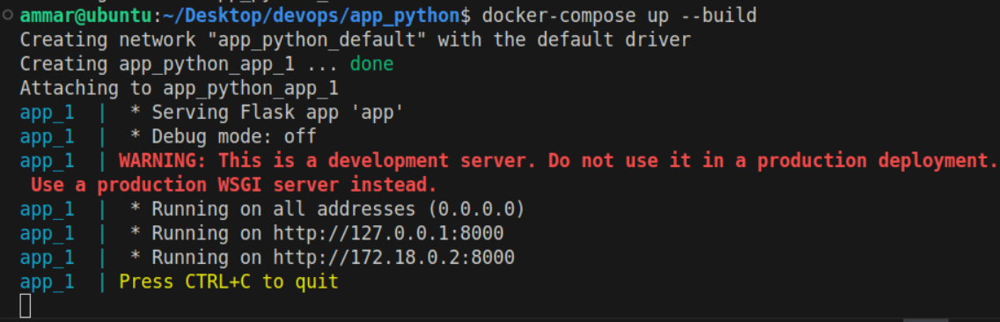
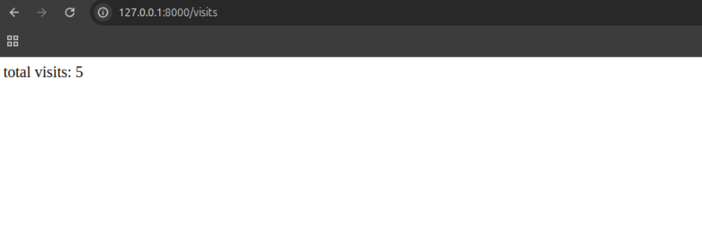
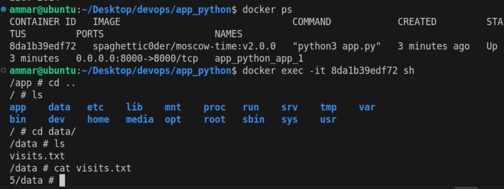
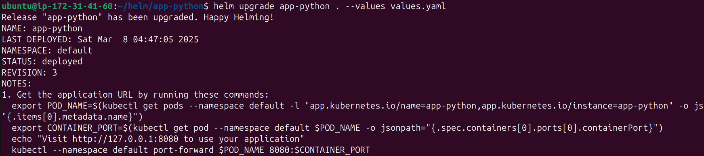
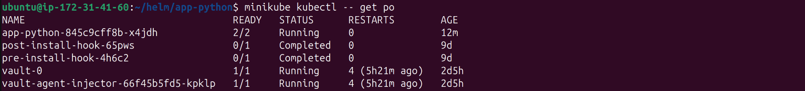
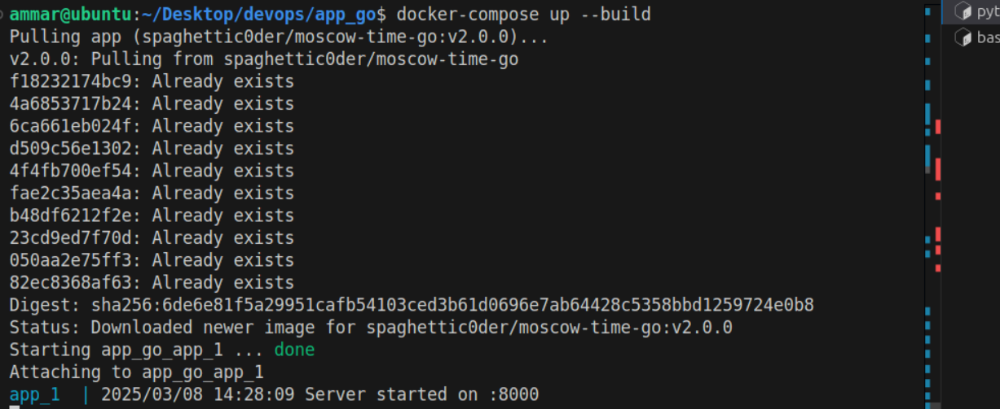
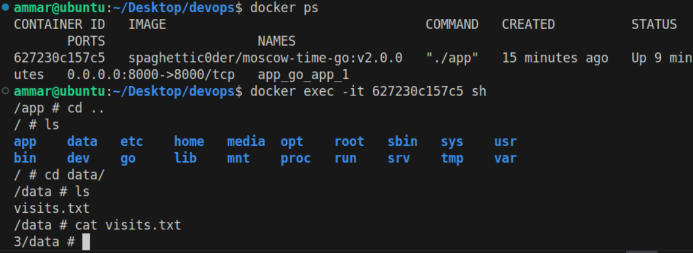
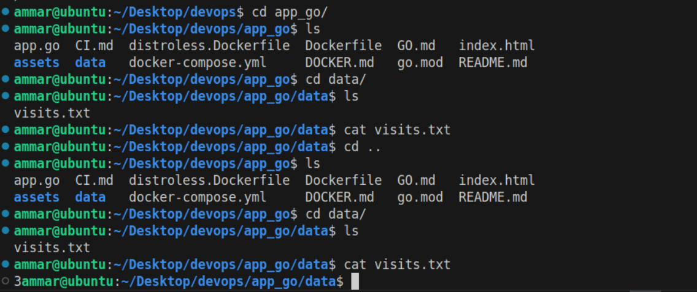
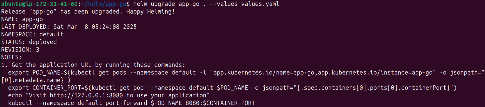
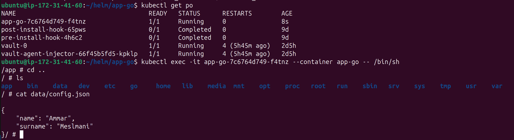

# Lab 12: Kubernetes ConfigMaps

## Task 1:

- let's apply persistency to `app-python` by modifying `app.python` file and `Dockerfile` and creating a `docker-compose.yml` file
- `Dockerfile` will ensure creating `/data` directory and `visits.txt` file inside it
  ```
  RUN mkdir -p /data

  RUN touch /data/visits.txt
  ```
- `docker-compose.yml` will pull the image and ensure correct mapping between `./data` and `/data`:
  ```
  version: '3.8'

  services:
    app:
      image: spaghettic0der/moscow-time:v2.0.0
      ports:
        - "8000:8000"
      volumes:
        - ./data:/data
  ```
- let's execute the `docker-compose` file using `docker-compose up --build`:
- 
- let's navigate 5 times to `http://127.0.0.1:8000/` and then let's check the counter by navigating to `http://127.0.0.1:8000/visits`:
- 
- let's access the shell and check `visits.txt` file:
- 
- let's check `visits.txt` file locally:
- 
- let's stop the docker-compose using `docker-compose down -v` and re-build it again using `docker-compose up --build`, by navigating to `http://127.0.0.1:8000/visits`, we can see that `Total visits: 5` which ensure the consistency of our data

## Task 2:

- let's update `values.yaml` file by adding the following parts:

  ```
  volumes:
    - name: config-volume
      configMap:
        name: app-python-config

  volumeMounts:
    - name: config-volume
      mountPath: "/data/config.json"
      subPath: "config.json"
      readOnly: true

  config:
    path: "files/config.json"
  ```
- let's create `files/config.json`:

  ```
  {
      "name": "Ammar",
      "surname": "Meslmani"
    }

  ```
- let's create `configmap.yaml`:

  ```
  apiVersion: v1
  kind: ConfigMap
  metadata:
    name: {{ .Release.Name }}-config
  data:
    config.json: |-
      {{ .Files.Get "files/config.json" | nindent 4 }}

  ```
- let's upgrade the chart:
- 
- let's check the configmaps by executing `minikube kubectl -- get configmaps`

  ```
  NAME                DATA   AGE
  app-python-config   1      18m
  kube-root-ca.crt    1      9d
  ```
- now let's get the pods:
- 
- let's check the config file locally inside the pod:
- 
- pod's description using `minikube kubectl -- describe pod app-python-845c9cff8b-x4jdh`:

  ```
  Name:             app-python-845c9cff8b-x4jdh
  Namespace:        default
  Priority:         0
  Service Account:  internal-app
  Node:             minikube/192.168.49.2
  Start Time:       Sat, 08 Mar 2025 04:47:07 +0000
  Labels:           app.kubernetes.io/instance=app-python
                    app.kubernetes.io/managed-by=Helm
                    app.kubernetes.io/name=app-python
                    app.kubernetes.io/version=1.16.0
                    helm.sh/chart=app-python-0.1.0
                    pod-template-hash=845c9cff8b
  Annotations:      vault.hashicorp.com/agent-inject: true
                    vault.hashicorp.com/agent-inject-secret-database-config.txt: internal/data/database/config
                    vault.hashicorp.com/agent-inject-status: injected
                    vault.hashicorp.com/role: internal-app
  Status:           Running
  IP:               10.244.0.112
  IPs:
    IP:           10.244.0.112
  Controlled By:  ReplicaSet/app-python-845c9cff8b
  Init Containers:
    vault-agent-init:
      Container ID:  docker://8d7daedb8b82237157ef994e9f526a2d8e34bef0965842ff0f428f7d95022c34
      Image:         hashicorp/vault:1.18.1
      Image ID:      docker-pullable://hashicorp/vault@sha256:3580fa352195aa7e76449cb8fadeef6d2f90a454c38982d30cf094e9013be786
      Port:          <none>
      Host Port:     <none>
      Command:
        /bin/sh
        -ec
      Args:
        echo ${VAULT_CONFIG?} | base64 -d > /home/vault/config.json && vault agent -config=/home/vault/config.json
      State:          Terminated
        Reason:       Completed
        Exit Code:    0
        Started:      Sat, 08 Mar 2025 04:47:08 +0000
        Finished:     Sat, 08 Mar 2025 04:47:08 +0000
      Ready:          True
      Restart Count:  0
      Limits:
        cpu:     500m
        memory:  128Mi
      Requests:
        cpu:     250m
        memory:  64Mi
      Environment:
        NAMESPACE:         default (v1:metadata.namespace)
        HOST_IP:            (v1:status.hostIP)
        POD_IP:             (v1:status.podIP)
        VAULT_LOG_LEVEL:   info
        VAULT_LOG_FORMAT:  standard
        VAULT_CONFIG:      eyJhdXRvX2F1dGgiOnsibWV0aG9kIjp7InR5cGUiOiJrdWJlcm5ldGVzIiwibW91bnRfcGF0aCI6ImF1dGgva3ViZXJuZXRlcyIsImNvbmZpZyI6eyJyb2xlIjoiaW50ZXJuYWwtYXBwIiwidG9rZW5fcGF0aCI6Ii92YXIvcnVuL3NlY3JldHMva3ViZXJuZXRlcy5pby9zZXJ2aWNlYWNjb3VudC90b2tlbiJ9fSwic2luayI6W3sidHlwZSI6ImZpbGUiLCJjb25maWciOnsicGF0aCI6Ii9ob21lL3ZhdWx0Ly52YXVsdC10b2tlbiJ9fV19LCJleGl0X2FmdGVyX2F1dGgiOnRydWUsInBpZF9maWxlIjoiL2hvbWUvdmF1bHQvLnBpZCIsInZhdWx0Ijp7ImFkZHJlc3MiOiJodHRwOi8vdmF1bHQuZGVmYXVsdC5zdmM6ODIwMCJ9LCJ0ZW1wbGF0ZSI6W3siZGVzdGluYXRpb24iOiIvdmF1bHQvc2VjcmV0cy9kYXRhYmFzZS1jb25maWcudHh0IiwiY29udGVudHMiOiJ7eyB3aXRoIHNlY3JldCBcImludGVybmFsL2RhdGEvZGF0YWJhc2UvY29uZmlnXCIgfX17eyByYW5nZSAkaywgJHYgOj0gLkRhdGEgfX17eyAkayB9fToge3sgJHYgfX1cbnt7IGVuZCB9fXt7IGVuZCB9fSIsImxlZnRfZGVsaW1pdGVyIjoie3siLCJyaWdodF9kZWxpbWl0ZXIiOiJ9fSJ9XSwidGVtcGxhdGVfY29uZmlnIjp7ImV4aXRfb25fcmV0cnlfZmFpbHVyZSI6dHJ1ZX19
      Mounts:
        /home/vault from home-init (rw)
        /var/run/secrets/kubernetes.io/serviceaccount from kube-api-access-z7wq6 (ro)
        /vault/secrets from vault-secrets (rw)
  Containers:
    app-python:
      Container ID:   docker://a1e1bb6af446897b3d7c24589db8b1d6b694840a927335884b2b8c9d07879352
      Image:          spaghettic0der/moscow-time:latest
      Image ID:       docker-pullable://spaghettic0der/moscow-time@sha256:961b53369f31a672bb961a08d6f3e035da370563717cc23966d767f267220730
      Port:           8000/TCP
      Host Port:      0/TCP
      State:          Running
        Started:      Sat, 08 Mar 2025 05:02:59 +0000
      Last State:     Terminated
        Reason:       Error
        Exit Code:    137
        Started:      Sat, 08 Mar 2025 05:01:49 +0000
        Finished:     Sat, 08 Mar 2025 05:02:59 +0000
      Ready:          True
      Restart Count:  3
      Limits:
        cpu:     500m
        memory:  256Mi
      Requests:
        cpu:      250m
        memory:   128Mi
      Liveness:   http-get http://:http/ delay=0s timeout=1s period=10s #success=1 #failure=3
      Readiness:  http-get http://:http/ delay=0s timeout=1s period=10s #success=1 #failure=3
      Environment:
        APP_ENV:  production
        DEBUG:    false
      Mounts:
        /data/config.json from config-volume (ro,path="config.json")
        /var/run/secrets/kubernetes.io/serviceaccount from kube-api-access-z7wq6 (ro)
        /vault/secrets from vault-secrets (rw)
    vault-agent:
      Container ID:  docker://d7cf11dfb41d77977e37d3d64ef0269696896874d9bdeb16d772f7c3ac168deb
      Image:         hashicorp/vault:1.18.1
      Image ID:      docker-pullable://hashicorp/vault@sha256:3580fa352195aa7e76449cb8fadeef6d2f90a454c38982d30cf094e9013be786
      Port:          <none>
      Host Port:     <none>
      Command:
        /bin/sh
        -ec
      Args:
        echo ${VAULT_CONFIG?} | base64 -d > /home/vault/config.json && vault agent -config=/home/vault/config.json
      State:          Running
        Started:      Sat, 08 Mar 2025 04:47:09 +0000
      Ready:          True
      Restart Count:  0
      Limits:
        cpu:     500m
        memory:  128Mi
      Requests:
        cpu:     250m
        memory:  64Mi
      Environment:
        NAMESPACE:         default (v1:metadata.namespace)
        HOST_IP:            (v1:status.hostIP)
        POD_IP:             (v1:status.podIP)
        VAULT_LOG_LEVEL:   info
        VAULT_LOG_FORMAT:  standard
        VAULT_CONFIG:      eyJhdXRvX2F1dGgiOnsibWV0aG9kIjp7InR5cGUiOiJrdWJlcm5ldGVzIiwibW91bnRfcGF0aCI6ImF1dGgva3ViZXJuZXRlcyIsImNvbmZpZyI6eyJyb2xlIjoiaW50ZXJuYWwtYXBwIiwidG9rZW5fcGF0aCI6Ii92YXIvcnVuL3NlY3JldHMva3ViZXJuZXRlcy5pby9zZXJ2aWNlYWNjb3VudC90b2tlbiJ9fSwic2luayI6W3sidHlwZSI6ImZpbGUiLCJjb25maWciOnsicGF0aCI6Ii9ob21lL3ZhdWx0Ly52YXVsdC10b2tlbiJ9fV19LCJleGl0X2FmdGVyX2F1dGgiOmZhbHNlLCJwaWRfZmlsZSI6Ii9ob21lL3ZhdWx0Ly5waWQiLCJ2YXVsdCI6eyJhZGRyZXNzIjoiaHR0cDovL3ZhdWx0LmRlZmF1bHQuc3ZjOjgyMDAifSwidGVtcGxhdGUiOlt7ImRlc3RpbmF0aW9uIjoiL3ZhdWx0L3NlY3JldHMvZGF0YWJhc2UtY29uZmlnLnR4dCIsImNvbnRlbnRzIjoie3sgd2l0aCBzZWNyZXQgXCJpbnRlcm5hbC9kYXRhL2RhdGFiYXNlL2NvbmZpZ1wiIH19e3sgcmFuZ2UgJGssICR2IDo9IC5EYXRhIH19e3sgJGsgfX06IHt7ICR2IH19XG57eyBlbmQgfX17eyBlbmQgfX0iLCJsZWZ0X2RlbGltaXRlciI6Int7IiwicmlnaHRfZGVsaW1pdGVyIjoifX0ifV0sInRlbXBsYXRlX2NvbmZpZyI6eyJleGl0X29uX3JldHJ5X2ZhaWx1cmUiOnRydWV9fQ==
      Mounts:
        /home/vault from home-sidecar (rw)
        /var/run/secrets/kubernetes.io/serviceaccount from kube-api-access-z7wq6 (ro)
        /vault/secrets from vault-secrets (rw)
  Conditions:
    Type                        Status
    PodReadyToStartContainers   True 
    Initialized                 True 
    Ready                       True 
    ContainersReady             True 
    PodScheduled                True 
  Volumes:
    config-volume:
      Type:      ConfigMap (a volume populated by a ConfigMap)
      Name:      app-python-config
      Optional:  false
    kube-api-access-z7wq6:
      Type:                    Projected (a volume that contains injected data from multiple sources)
      TokenExpirationSeconds:  3607
      ConfigMapName:           kube-root-ca.crt
      ConfigMapOptional:       <nil>
      DownwardAPI:             true
    home-init:
      Type:       EmptyDir (a temporary directory that shares a pod's lifetime)
      Medium:     Memory
      SizeLimit:  <unset>
    home-sidecar:
      Type:       EmptyDir (a temporary directory that shares a pod's lifetime)
      Medium:     Memory
      SizeLimit:  <unset>
    vault-secrets:
      Type:        EmptyDir (a temporary directory that shares a pod's lifetime)
      Medium:      Memory
      SizeLimit:   <unset>
  QoS Class:       Burstable
  Node-Selectors:  <none>
  Tolerations:     node.kubernetes.io/not-ready:NoExecute op=Exists for 300s
                   node.kubernetes.io/unreachable:NoExecute op=Exists for 300s
  Events:
    Type     Reason            Age                   From               Message
    ----     ------            ----                  ----               -------
    Warning  FailedScheduling  16m                   default-scheduler  0/1 nodes are available: 1 Insufficient cpu. preemption: 0/1 nodes are available: 1 No preemption victims found for incoming pod.
    Normal   Scheduled         16m                   default-scheduler  Successfully assigned default/app-python-845c9cff8b-x4jdh to minikube
    Normal   Pulled            16m                   kubelet            Container image "hashicorp/vault:1.18.1" already present on machine
    Normal   Created           16m                   kubelet            Created container: vault-agent-init
    Normal   Started           16m                   kubelet            Started container vault-agent-init
    Normal   Created           16m                   kubelet            Created container: vault-agent
    Normal   Pulled            16m                   kubelet            Container image "hashicorp/vault:1.18.1" already present on machine
    Normal   Started           16m                   kubelet            Started container vault-agent
    Warning  Unhealthy         3m24s (x10 over 13m)  kubelet            Liveness probe failed: Get "http://10.244.0.112:8000/": context deadline exceeded (Client.Timeout exceeded while awaiting headers)
    Warning  Unhealthy         90s (x28 over 16m)    kubelet            Readiness probe failed: Get "http://10.244.0.112:8000/": context deadline exceeded (Client.Timeout exceeded while awaiting headers)
    Normal   Killing           74s (x3 over 3m24s)   kubelet            Container app-python failed liveness probe, will be restarted
    Normal   Created           44s (x4 over 16m)     kubelet            Created container: app-python
    Normal   Started           44s (x4 over 16m)     kubelet            Started container app-python
    Normal   Pulled            44s (x4 over 16m)     kubelet            Container image "spaghettic0der/moscow-time:latest" already present on machine

  ```

## Bonus:

### Part 1:

- let's apply persistency to `app-go` by modifying `app.go` file and `Dockerfile` and creating a `docker-compose.yml` file
- `Dockerfile` will ensure creating `/data` directory and `visits.txt` file inside it

  ```
  RUN mkdir -p /data

  RUN touch /data/visits.txt
  ```
- `docker-compose.yml` will pull the image and ensure correct mapping between `./data` and `/data`:

  ```
  version: '3.8'

  services:
    app:
      image: spaghettic0der/moscow-time-go:v2.0.0
      ports:
        - "8000:8000"
      volumes:
        - ./data:/data
  ```
- let's execute the `docker-compose` file using `docker-compose up --build`:
- 
- let's navigate 3 times to `http://127.0.0.1:8000/` and then let's check the counter by navigating to `http://127.0.0.1:8000/visits`:
- 
- let's access the shell and check `visits.txt` file:
- 
- let's check `visits.txt` file locally:
- 
- let's stop the docker-compose using `docker-compose down -v` and re-build it again using `docker-compose up --build`, by navigating to `http://127.0.0.1:8000/visits`, we can see that `Total visits: 3` which ensure the consistency of our data

### Part 2:

- let's redo the steps from Task2 for `app-go` and check outputs:
- 
- 
- pod's description using `minikube kubectl -- describe pod app-go-7c6764d749-f4tnz`:

  ```
  Name:             app-go-7c6764d749-f4tnz
  Namespace:        default
  Priority:         0
  Service Account:  app-go
  Node:             minikube/192.168.49.2
  Start Time:       Sat, 08 Mar 2025 05:24:08 +0000
  Labels:           app.kubernetes.io/instance=app-go
                    app.kubernetes.io/managed-by=Helm
                    app.kubernetes.io/name=app-go
                    app.kubernetes.io/version=1.16.0
                    helm.sh/chart=app-go-0.1.0
                    pod-template-hash=7c6764d749
  Annotations:      <none>
  Status:           Running
  IP:               10.244.0.115
  IPs:
    IP:           10.244.0.115
  Controlled By:  ReplicaSet/app-go-7c6764d749
  Containers:
    app-go:
      Container ID:   docker://9d0a3e8b47c19fcd336ade718abd6dd2c791f677ab5625fdc9820c7a1eb4a0b0
      Image:          spaghettic0der/moscow-time-go:latest
      Image ID:       docker-pullable://spaghettic0der/moscow-time-go@sha256:c51ad9f8f17545ac1f995d36b86e01360180f97cc0315a015b99534f4526faa6
      Port:           8000/TCP
      Host Port:      0/TCP
      State:          Running
        Started:      Sat, 08 Mar 2025 05:24:09 +0000
      Ready:          True
      Restart Count:  0
      Limits:
        cpu:     500m
        memory:  256Mi
      Requests:
        cpu:      250m
        memory:   128Mi
      Liveness:   http-get http://:http/ delay=0s timeout=1s period=10s #success=1 #failure=3
      Readiness:  http-get http://:http/ delay=0s timeout=1s period=10s #success=1 #failure=3
      Environment:
        APP_ENV:  production
        DEBUG:    false
      Mounts:
        /data/config.json from config-volume (ro,path="config.json")
        /var/run/secrets/kubernetes.io/serviceaccount from kube-api-access-khkrm (ro)
  Conditions:
    Type                        Status
    PodReadyToStartContainers   True 
    Initialized                 True 
    Ready                       True 
    ContainersReady             True 
    PodScheduled                True 
  Volumes:
    config-volume:
      Type:      ConfigMap (a volume populated by a ConfigMap)
      Name:      app-go-config
      Optional:  false
    kube-api-access-khkrm:
      Type:                    Projected (a volume that contains injected data from multiple sources)
      TokenExpirationSeconds:  3607
      ConfigMapName:           kube-root-ca.crt
      ConfigMapOptional:       <nil>
      DownwardAPI:             true
  QoS Class:                   Burstable
  Node-Selectors:              <none>
  Tolerations:                 node.kubernetes.io/not-ready:NoExecute op=Exists for 300s
                               node.kubernetes.io/unreachable:NoExecute op=Exists for 300s
  Events:
    Type     Reason     Age    From               Message
    ----     ------     ----   ----               -------
    Normal   Scheduled  3m46s  default-scheduler  Successfully assigned default/app-go-7c6764d749-f4tnz to minikube
    Normal   Pulled     3m45s  kubelet            Container image "spaghettic0der/moscow-time-go:latest" already present on machine
    Normal   Created    3m45s  kubelet            Created container: app-go
    Normal   Started    3m45s  kubelet            Started container app-go
    Warning  Unhealthy  34s    kubelet            Liveness probe failed: Get "http://10.244.0.115:8000/": context deadline exceeded (Client.Timeout exceeded while awaiting headers)
  ```
