# Lab 9:

## Task 1:

- let's create an aws instance and connect to it using ssh:
- 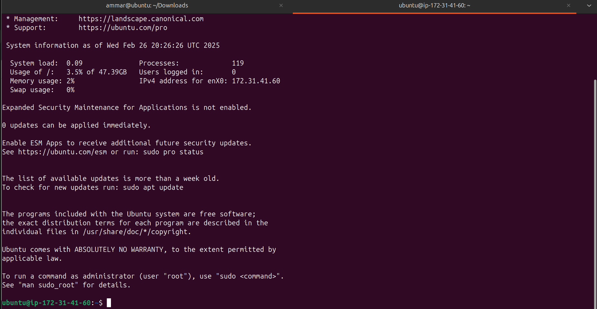
- let's install `minikube` from the official site:
- 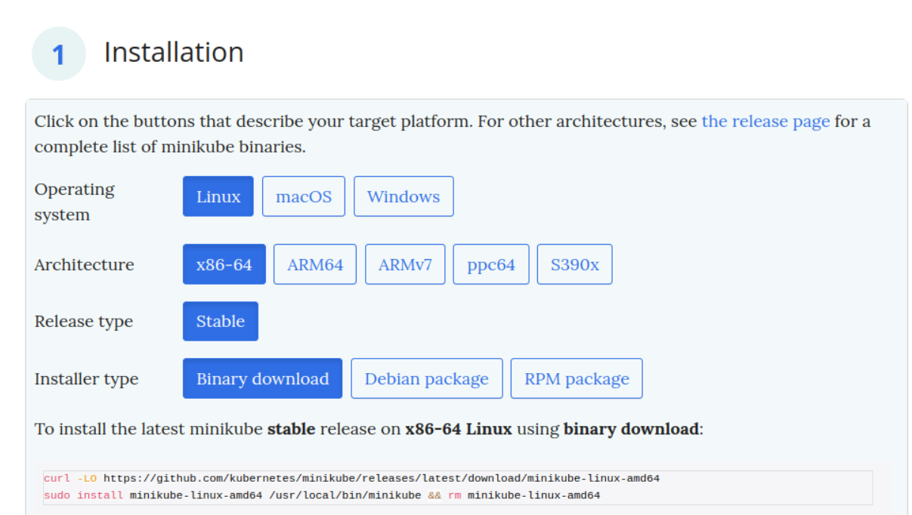
- 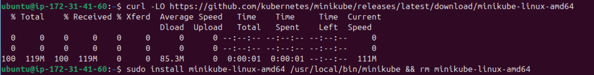
- let's start a cluster with `docker` driver (at the last line we can see that `kubectl has been configured`)
- 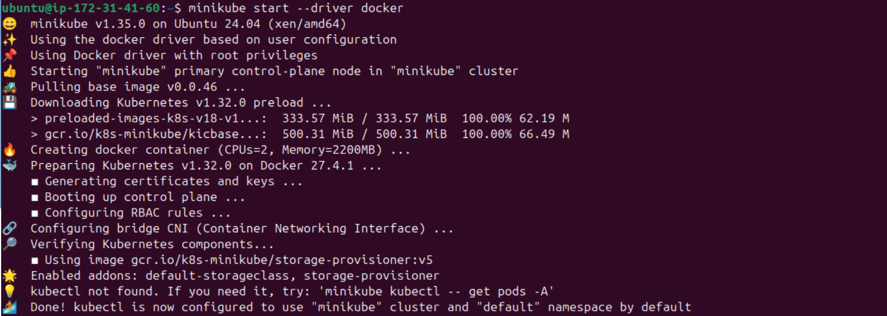
- let's check the `minikube's` status:
- 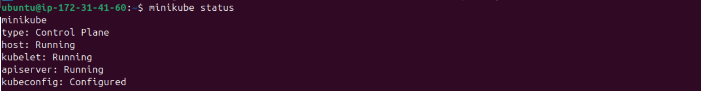
- let's add `kubectl` and check it:
- 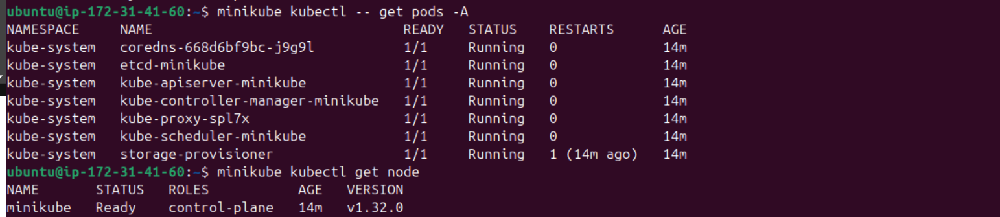
- let's deploy our app_python:
- 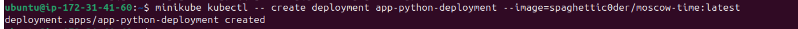
- let's create a service to expose our application on port 9100:
- 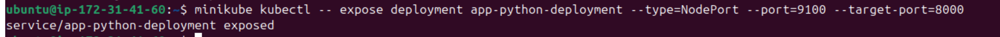
- let's execute `kubectl get pods,svc`
- 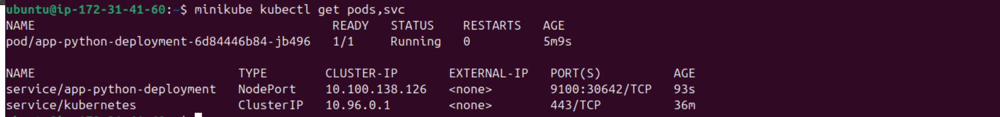
- let's clean up:
  - delete the deployment:
  - 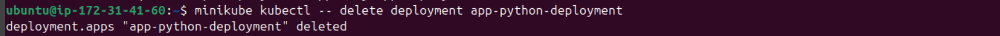
  - delete the service:
  - 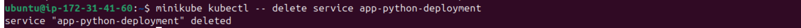

## Task 2:

- let's create `deployment.yml` file:
- 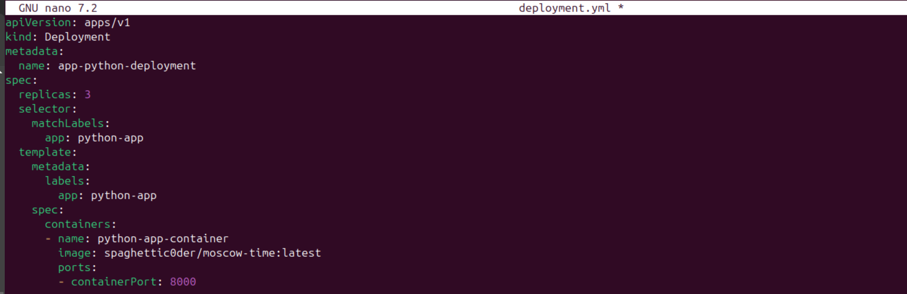
- let's create `service.yml` file:
- 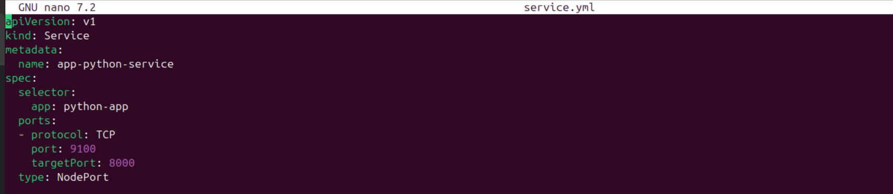
- let's apply both the deployment and the service:
- 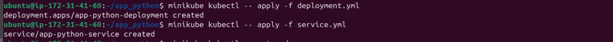
- let's execute `minikube kubectl -- get pods`, `minikube kubectl -- get svc`
- 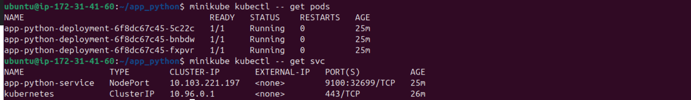
- let's execute `minikube service --all`
- 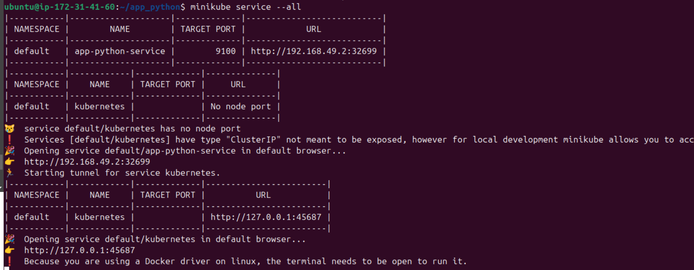
- now since i'm using an aws instance, and a docker driver for minikube, i can only access the url of the service internally:
- 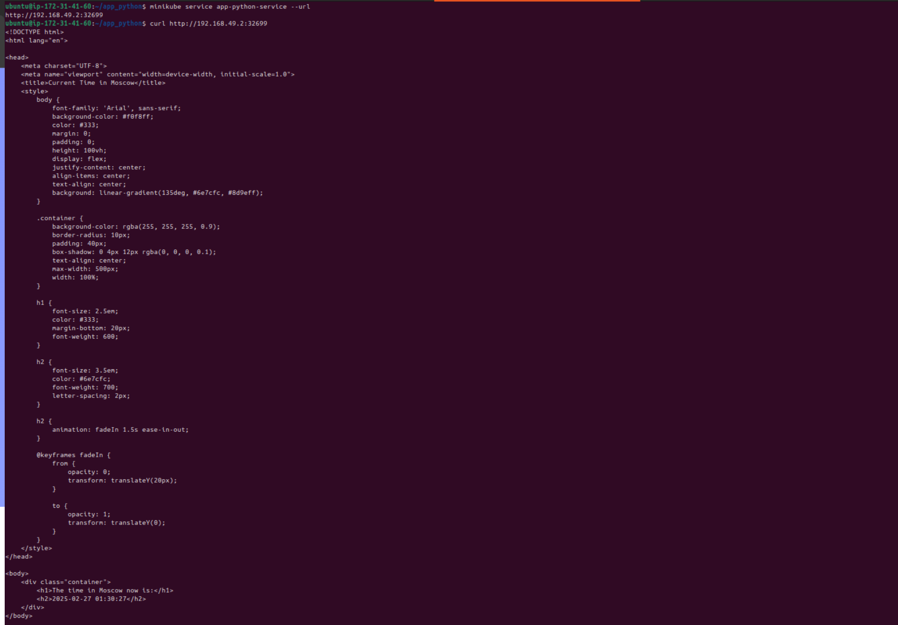
- to access the service externally on my local machine, some extra steps should be followed: (it took long time to figure it out :/ )

  - first let's make a port-forward to direct requests going to 32699 to 9100
  - 
  - then let's ssh to the instance and let requests to port 32699 be available on my localhost port 32700
  - 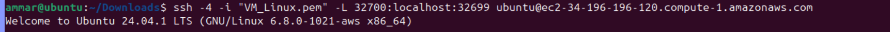
  - now let's check the magic and navigate to localhost:32700 on the browser:
  - 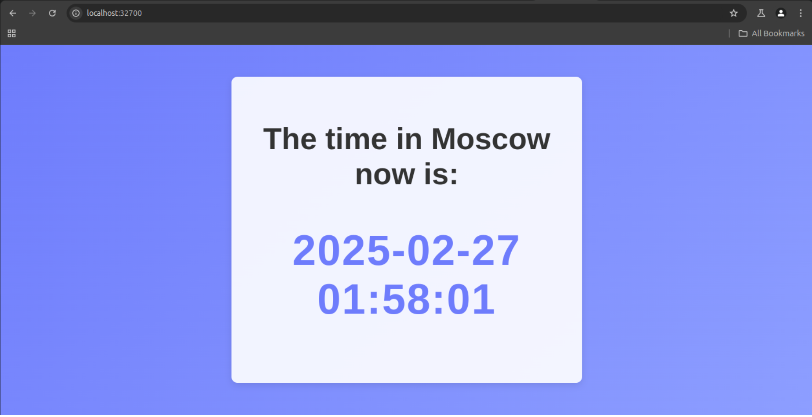
  - 

## Bonus:

- let's create the `deployment.yml` file:
- 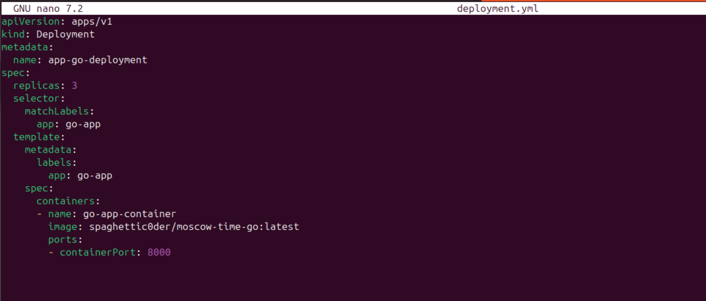
- let's create the `service.yml` file:
- 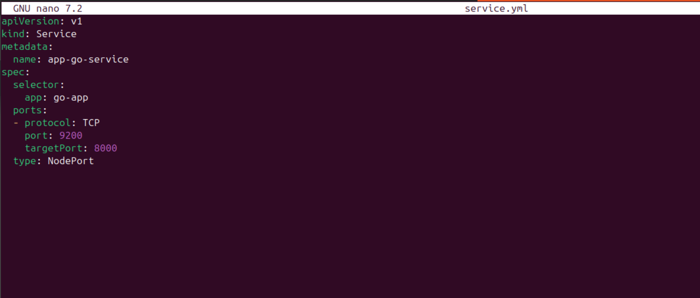
- let's create the `ingress.yml` file:
- 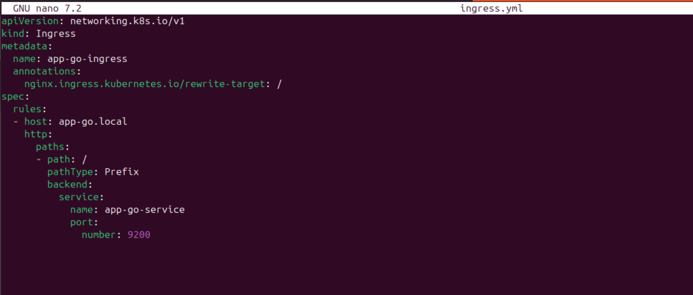
- let's enable ingress addon:
- 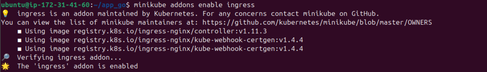
- let's apply the files:
- 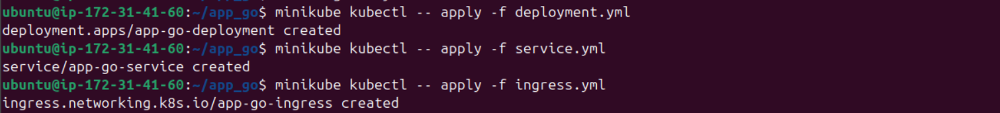
- let's get the ingress IP and push it to the hosts file:
- 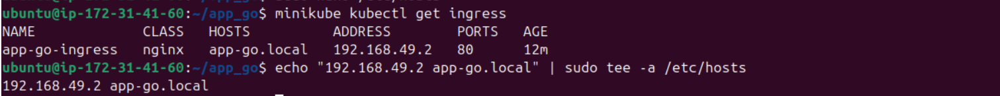
- and finally let's curl to check:
- 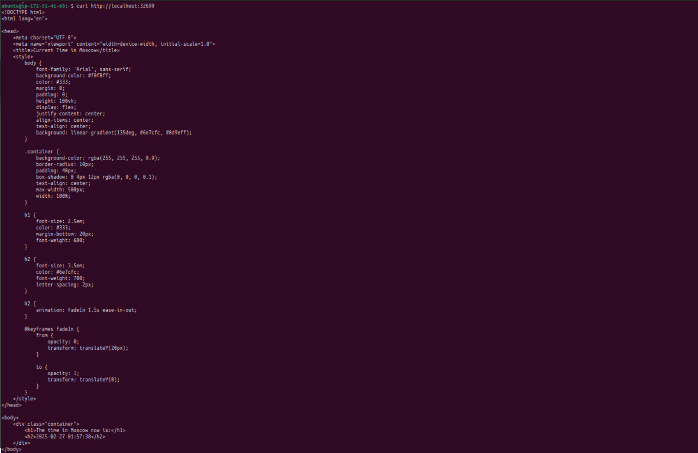
- everything is working fine! a final check to the cluster:
- 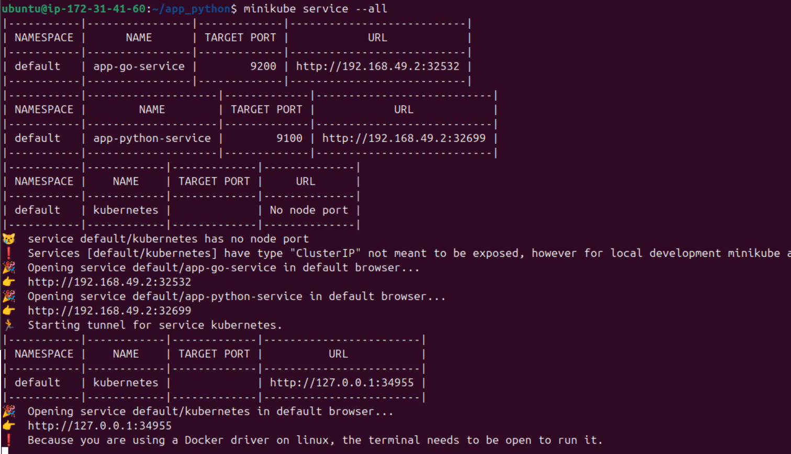
