# Lab 10:

## Task1:

- let's install `helm`:
- 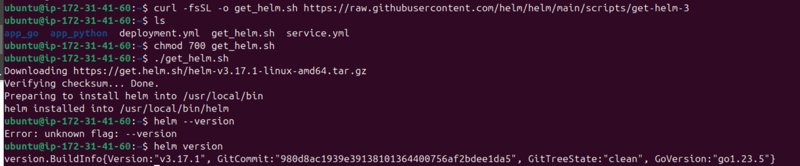
- let's create our own helm chart, update the `values.yml` file (image name, tag, port) and install the helm chart:
- 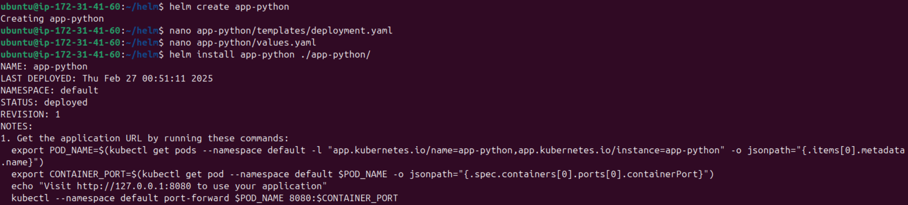
- since i'm working on an aws instance, i need to set up ssh tunneling to access the dashboard on my local machine, after the setup and after running the dashboard:
- 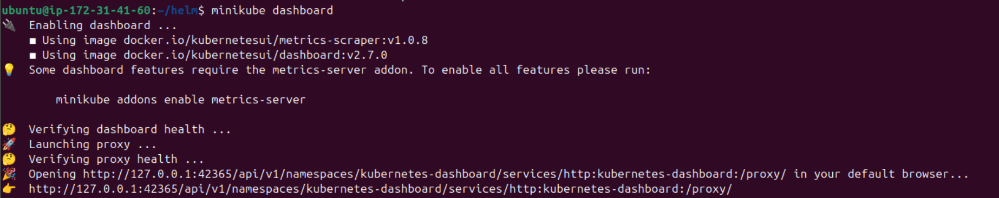
- 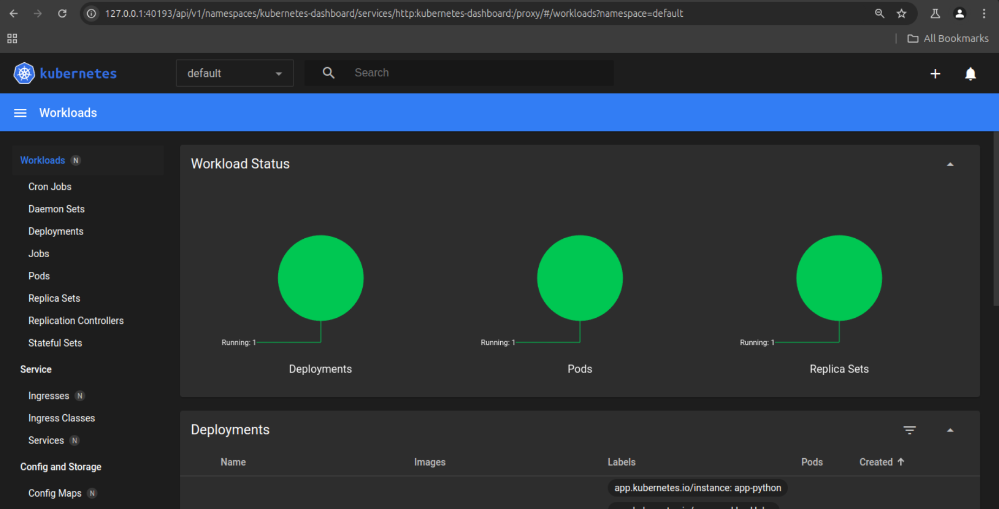
- let's confirm that our applicaiton is accessible by running `minikube service app-python`:
- 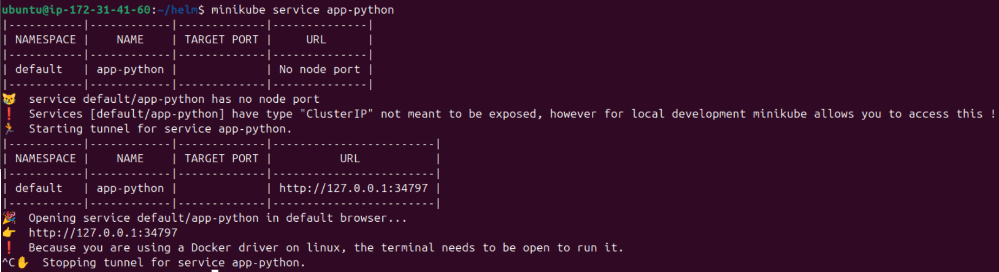
- the output of `minikube kubectl -- get pods`, and `minikube kubectl -- get svc`:
- 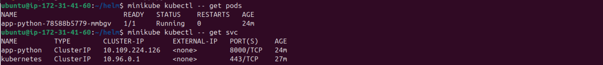

## Task2:

- let's create `pre-install-hook.yml`:
- 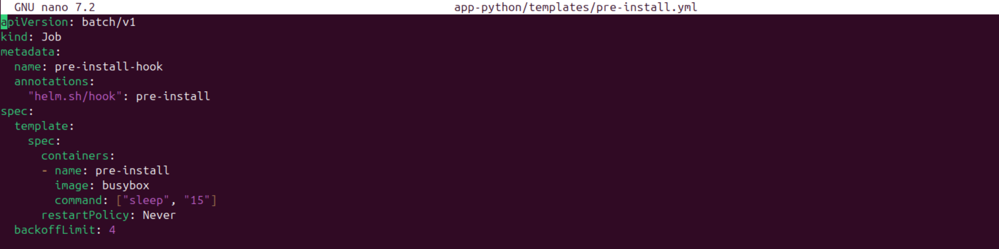
- let's create `post-install-hook.yml`:
- 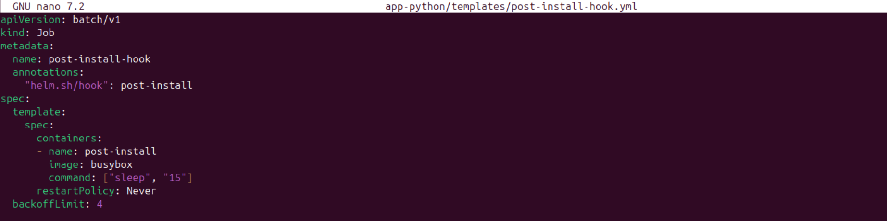
- let's lint the app:
- 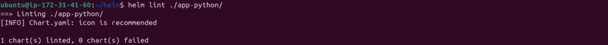
- now let's perform a dry run by executing `helm install --dry-run helm-hooks ./app-python/`:
- ```
  NAME: helm-hooks
  LAST DEPLOYED: Thu Feb 27 02:07:46 2025
  NAMESPACE: default
  STATUS: pending-install
  REVISION: 1
  HOOKS:
  ---
  # Source: app-python/templates/tests/test-connection.yaml
  apiVersion: v1
  kind: Pod
  metadata:
    name: "helm-hooks-app-python-test-connection"
    labels:
      helm.sh/chart: app-python-0.1.0
      app.kubernetes.io/name: app-python
      app.kubernetes.io/instance: helm-hooks
      app.kubernetes.io/version: "1.16.0"
      app.kubernetes.io/managed-by: Helm
    annotations:
      "helm.sh/hook": test
  spec:
    containers:
      - name: wget
        image: busybox
        command: ['wget']
        args: ['helm-hooks-app-python:8000']
    restartPolicy: Never
  ---
  # Source: app-python/templates/post-install-hook.yml
  apiVersion: batch/v1
  kind: Job
  metadata:
    name: post-install-hook
    annotations:
      "helm.sh/hook": post-install
  spec:
    template:
      spec:
        containers:
        - name: post-install
          image: busybox
          command: ["sleep", "15"]
        restartPolicy: Never
    backoffLimit: 4
  ---
  # Source: app-python/templates/pre-install.yml
  apiVersion: batch/v1
  kind: Job
  metadata:
    name: pre-install-hook
    annotations:
      "helm.sh/hook": pre-install
  spec:
    template:
      spec:
        containers:
        - name: pre-install
          image: busybox
          command: ["sleep", "15"]
        restartPolicy: Never
    backoffLimit: 4
  MANIFEST:
  ---
  # Source: app-python/templates/serviceaccount.yaml
  apiVersion: v1
  kind: ServiceAccount
  metadata:
    name: helm-hooks-app-python
    labels:
      helm.sh/chart: app-python-0.1.0
      app.kubernetes.io/name: app-python
      app.kubernetes.io/instance: helm-hooks
      app.kubernetes.io/version: "1.16.0"
      app.kubernetes.io/managed-by: Helm
  automountServiceAccountToken: true
  ---
  # Source: app-python/templates/service.yaml
  apiVersion: v1
  kind: Service
  metadata:
    name: helm-hooks-app-python
    labels:
      helm.sh/chart: app-python-0.1.0
      app.kubernetes.io/name: app-python
      app.kubernetes.io/instance: helm-hooks
      app.kubernetes.io/version: "1.16.0"
      app.kubernetes.io/managed-by: Helm
  spec:
    type: ClusterIP
    ports:
      - port: 8000
        targetPort: http
        protocol: TCP
        name: http
    selector:
      app.kubernetes.io/name: app-python
      app.kubernetes.io/instance: helm-hooks
  ---
  # Source: app-python/templates/deployment.yaml
  apiVersion: apps/v1
  kind: Deployment
  metadata:
    name: helm-hooks-app-python
    labels:
      helm.sh/chart: app-python-0.1.0
      app.kubernetes.io/name: app-python
      app.kubernetes.io/instance: helm-hooks
      app.kubernetes.io/version: "1.16.0"
      app.kubernetes.io/managed-by: Helm
  spec:
    replicas: 1
    selector:
      matchLabels:
        app.kubernetes.io/name: app-python
        app.kubernetes.io/instance: helm-hooks
    template:
      metadata:
        labels:
          helm.sh/chart: app-python-0.1.0
          app.kubernetes.io/name: app-python
          app.kubernetes.io/instance: helm-hooks
          app.kubernetes.io/version: "1.16.0"
          app.kubernetes.io/managed-by: Helm
      spec:
        serviceAccountName: helm-hooks-app-python
        containers:
          - name: app-python
            image: "spaghettic0der/moscow-time:latest"
            imagePullPolicy: IfNotPresent
            ports:
              - name: http
                containerPort: 8000
                protocol: TCP
            livenessProbe:
              httpGet:
                path: /
                port: http
            readinessProbe:
              httpGet:
                path: /
                port: http

  NOTES:
  1. Get the application URL by running these commands:
    export POD_NAME=$(kubectl get pods --namespace default -l "app.kubernetes.io/name=app-python,app.kubernetes.io/instance=helm-hooks" -o jsonpath="{.items[0].metadata.name}")
    export CONTAINER_PORT=$(kubectl get pod --namespace default $POD_NAME -o jsonpath="{.spec.containers[0].ports[0].containerPort}")
    echo "Visit http://127.0.0.1:8080 to use your application"
    kubectl --namespace default port-forward $POD_NAME 8080:$CONTAINER_PORT
  ```
- now let's uninstall and install the application again to perform the hooks (waiting 15s):
- 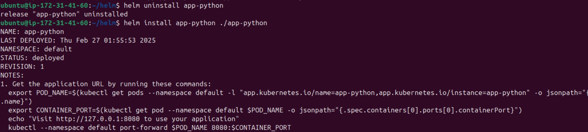
- now let's execute `minikube kubectl -- get po`:
- 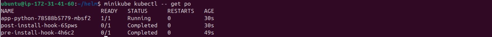
- now let's execute `minikube kubectl -- describe po pre-install-hook-4h6c2`:
- ```
  Name:             pre-install-hook-4h6c2
  Namespace:        default
  Priority:         0
  Service Account:  default
  Node:             minikube/192.168.49.2
  Start Time:       Thu, 27 Feb 2025 01:55:53 +0000
  Labels:           batch.kubernetes.io/controller-uid=cf409b42-2778-4af7-8deb-1957c257407e
                    batch.kubernetes.io/job-name=pre-install-hook
                    controller-uid=cf409b42-2778-4af7-8deb-1957c257407e
                    job-name=pre-install-hook
  Annotations:      <none>
  Status:           Succeeded
  IP:               10.244.0.33
  IPs:
    IP:           10.244.0.33
  Controlled By:  Job/pre-install-hook
  Containers:
    pre-install:
      Container ID:  docker://7f3b9c1bfb9ad6198e232e47aafd49f181783a3c6811f74f25e845995cc73557
      Image:         busybox
      Image ID:      docker-pullable://busybox@sha256:498a000f370d8c37927118ed80afe8adc38d1edcbfc071627d17b25c88efcab0
      Port:          <none>
      Host Port:     <none>
      Command:
        sleep
        15
      State:          Terminated
        Reason:       Completed
        Exit Code:    0
        Started:      Thu, 27 Feb 2025 01:55:54 +0000
        Finished:     Thu, 27 Feb 2025 01:56:09 +0000
      Ready:          False
      Restart Count:  0
      Environment:    <none>
      Mounts:
        /var/run/secrets/kubernetes.io/serviceaccount from kube-api-access-bkbp4 (ro)
  Conditions:
    Type                        Status
    PodReadyToStartContainers   False 
    Initialized                 True 
    Ready                       False 
    ContainersReady             False 
    PodScheduled                True 
  Volumes:
    kube-api-access-bkbp4:
      Type:                    Projected (a volume that contains injected data from multiple sources)
      TokenExpirationSeconds:  3607
      ConfigMapName:           kube-root-ca.crt
      ConfigMapOptional:       <nil>
      DownwardAPI:             true
  QoS Class:                   BestEffort
  Node-Selectors:              <none>
  Tolerations:                 node.kubernetes.io/not-ready:NoExecute op=Exists for 300s
                               node.kubernetes.io/unreachable:NoExecute op=Exists for 300s
  Events:
    Type    Reason     Age    From               Message
    ----    ------     ----   ----               -------
    Normal  Scheduled  2m31s  default-scheduler  Successfully assigned default/pre-install-hook-4h6c2 to minikube
    Normal  Pulling    2m30s  kubelet            Pulling image "busybox"
    Normal  Pulled     2m30s  kubelet            Successfully pulled image "busybox" in 139ms (139ms including waiting). Image size: 4269694 bytes.
    Normal  Created    2m30s  kubelet            Created container: pre-install
    Normal  Started    2m30s  kubelet            Started container pre-install

  ```
- and now let's execute `minikube kubectl -- describe po post-install-hook-65pws`:
- ```
  Name:             post-install-hook-65pws
  Namespace:        default
  Priority:         0
  Service Account:  default
  Node:             minikube/192.168.49.2
  Start Time:       Thu, 27 Feb 2025 01:56:12 +0000
  Labels:           batch.kubernetes.io/controller-uid=0a70f6e1-a697-4ffb-b5dd-a088b4c2c6cc
                    batch.kubernetes.io/job-name=post-install-hook
                    controller-uid=0a70f6e1-a697-4ffb-b5dd-a088b4c2c6cc
                    job-name=post-install-hook
  Annotations:      <none>
  Status:           Succeeded
  IP:               10.244.0.35
  IPs:
    IP:           10.244.0.35
  Controlled By:  Job/post-install-hook
  Containers:
    post-install:
      Container ID:  docker://8f625ddfde977760d48619de8f06b0287925a9e8538fb9f163baf0b212a904ec
      Image:         busybox
      Image ID:      docker-pullable://busybox@sha256:498a000f370d8c37927118ed80afe8adc38d1edcbfc071627d17b25c88efcab0
      Port:          <none>
      Host Port:     <none>
      Command:
        sleep
        15
      State:          Terminated
        Reason:       Completed
        Exit Code:    0
        Started:      Thu, 27 Feb 2025 01:56:13 +0000
        Finished:     Thu, 27 Feb 2025 01:56:28 +0000
      Ready:          False
      Restart Count:  0
      Environment:    <none>
      Mounts:
        /var/run/secrets/kubernetes.io/serviceaccount from kube-api-access-6wjhn (ro)
  Conditions:
    Type                        Status
    PodReadyToStartContainers   False 
    Initialized                 True 
    Ready                       False 
    ContainersReady             False 
    PodScheduled                True 
  Volumes:
    kube-api-access-6wjhn:
      Type:                    Projected (a volume that contains injected data from multiple sources)
      TokenExpirationSeconds:  3607
      ConfigMapName:           kube-root-ca.crt
      ConfigMapOptional:       <nil>
      DownwardAPI:             true
  QoS Class:                   BestEffort
  Node-Selectors:              <none>
  Tolerations:                 node.kubernetes.io/not-ready:NoExecute op=Exists for 300s
                               node.kubernetes.io/unreachable:NoExecute op=Exists for 300s
  Events:
    Type    Reason     Age   From               Message
    ----    ------     ----  ----               -------
    Normal  Scheduled  2m2s  default-scheduler  Successfully assigned default/post-install-hook-65pws to minikube
    Normal  Pulling    2m2s  kubelet            Pulling image "busybox"
    Normal  Pulled     2m2s  kubelet            Successfully pulled image "busybox" in 138ms (138ms including waiting). Image size: 4269694 bytes.
    Normal  Created    2m2s  kubelet            Created container: post-install
    Normal  Started    2m2s  kubelet            Started container post-install

  ```
- let's add hook delete policy by adding the following line to both `pre-install.yml` and `post-install.yml` in the **annotations** section:
- ```
  "helm.sh/hook-delete-policy": hook-succeeded
  ```

## Bonus:

- let's create a helm chart for `app-go`, update `values.yml` file, and install the application, and then check that it's accessible:
- 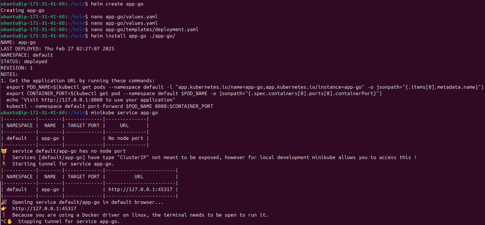
- let's create `library-chart`:
- 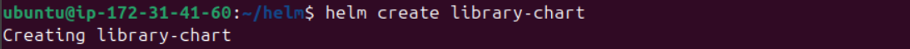
- let's change its type to a **library**, and let's follow instrucitons in this link [instructions](https://austindewey.com/2020/08/17/how-to-reduce-helm-chart-boilerplate-with-library-charts/)
- after updating the library, let's include it as a dependency for `app-python` and `app-go` by adding the following to the `Chart.yaml` for the both applications:
- ```
  dependencies:
  - name: library-chart
    version: "0.1.0"
    repository: "file://../library-chart"
  ```
- let's package the `library-chart` and update the dependency for the applications:
- 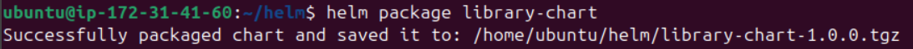
- 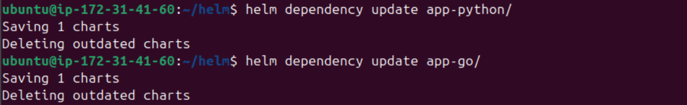
- now let's lint both applications:
- 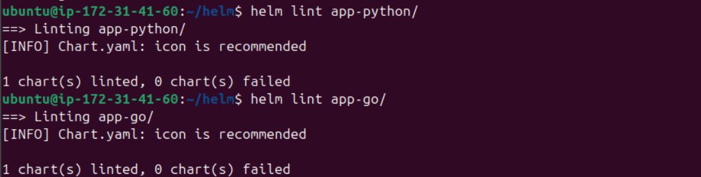
- now let's re-install the applications:
- 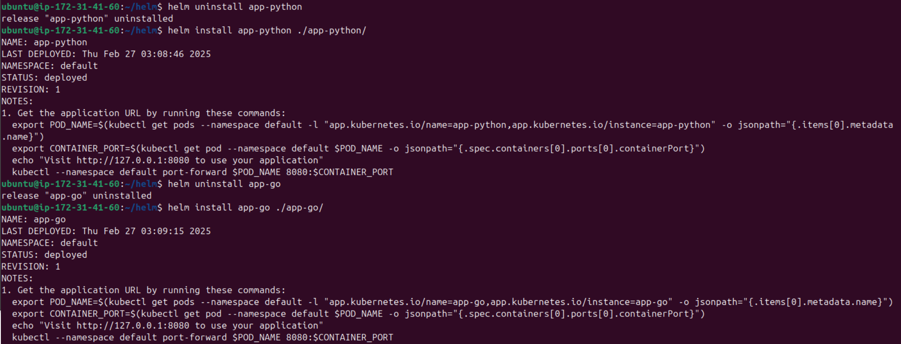
- let's check the helm list:
- 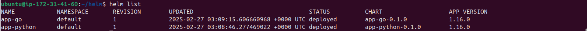
- let's check the services:
- 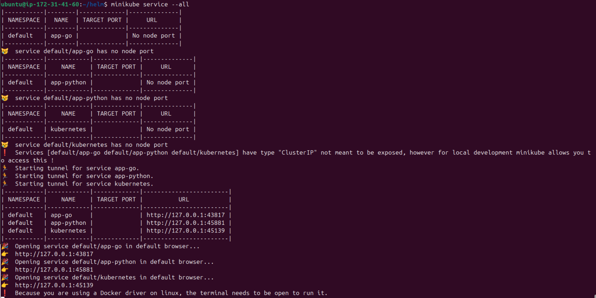
