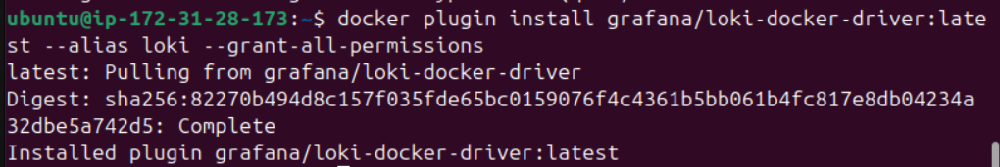
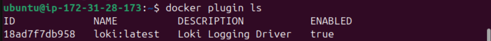
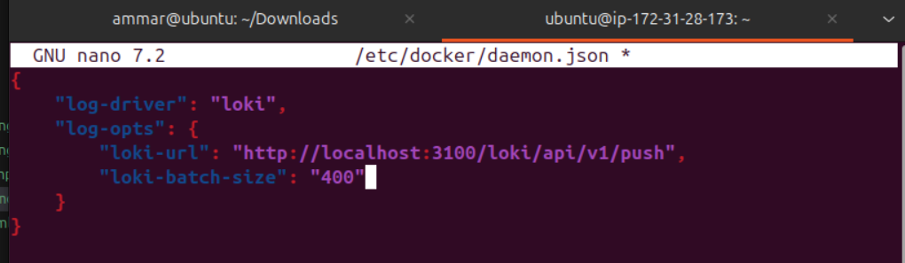
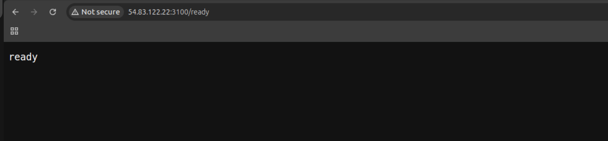
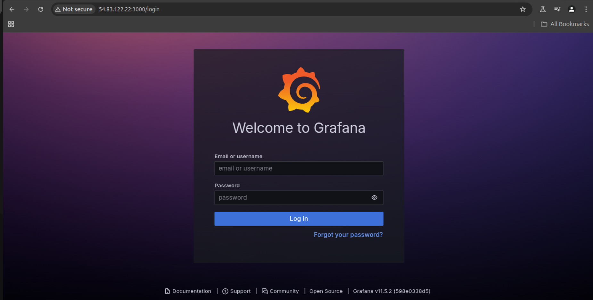
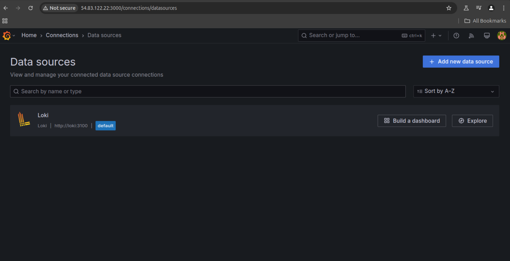
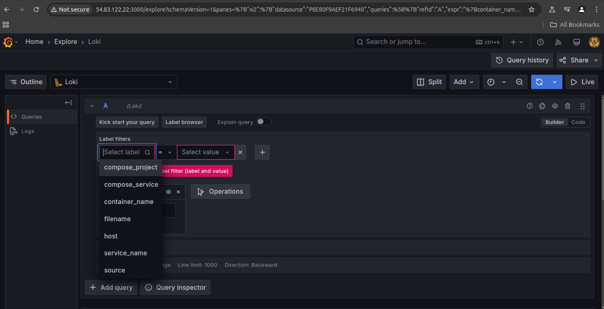
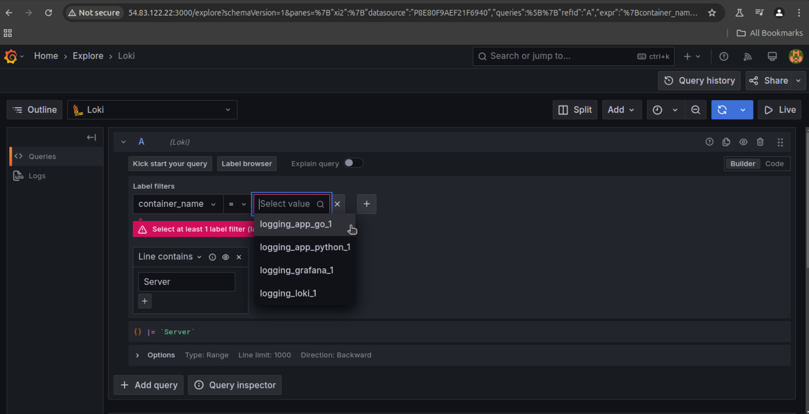
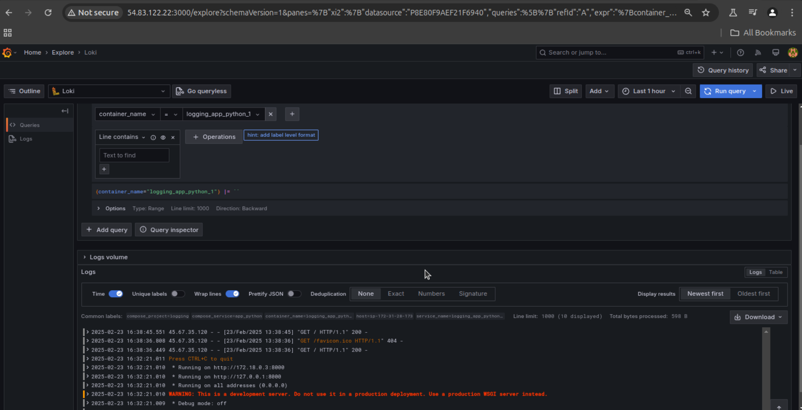
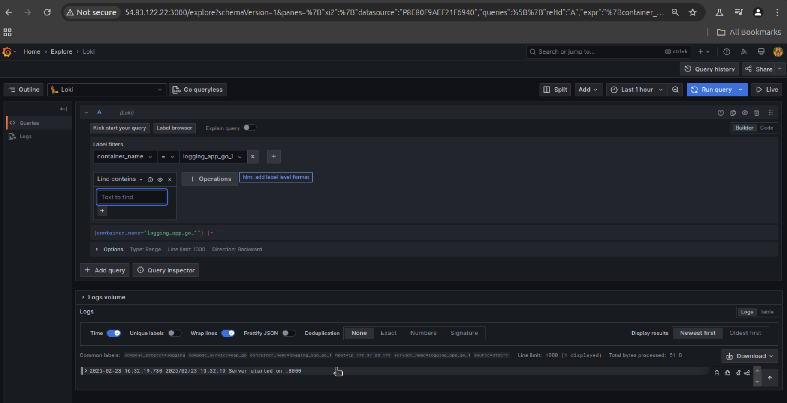

# Lab 7: Monitoring and Logging

## Preparing Instance:

- let's create an instance on AWS and install docker and docker-compse there
- let's install docker plugin to be able to collect logs and send them to loki
- 
- let's make sure it's installed
- 

## Configure Grafana

- then let's configure the daemon.json located in `/etc/docker`
- 
- let's create docker-compose and promtail files and compose up and check if loki is ready
- 
- now let's check grafana:
- 
- let's check connections:
- 

## Querying Logs

- let's navigate to `explore` and check our available options for querying, we can see that we can query logs from containers and our containers names are defined
- 
- 
- let's check logs from app_python:
- 
- let's check logs from app_go:
- 

# Components Roles:

## Grafana:

* **Role** : Visualization and monitoring tool.
* **Purpose** : Grafana is used to query, visualize, and analyze logs stored in Loki.
* **Key Features** :
  * Provides a user-friendly interface for creating dashboards and exploring logs.
  * Supports querying logs using Loki’s query language (LogQL).
  * Can be configured to send alerts based on log patterns.

## Loki:

* **Role** : Log aggregation and storage system.
* **Purpose** : Loki is responsible for storing and indexing logs. It receives logs from Promtail and provides an API for querying logs.
* **Key Features** :
  * Lightweight and highly scalable.
  * Uses a label-based indexing system (similar to Prometheus) for efficient log queries.
  * Does not store the full log text in the index, making it cost-effective.

## Promtail:

* **Role** : Log collection agent.
* **Purpose** : Promtail is responsible for collecting logs from the host system and applications, then forwarding them to Loki.
* **Key Features** :
  * Scrapes log files from specified directories.
  * Adds labels to logs for better organization and querying in Loki.
  * Can be configured to collect logs from Docker containers, system logs, or application logs.

## app_python:

* **Role** : Python-based application.
* **Purpose** : An application which we will collect and monitor its logs.
* **Key Features** :
  * Runs a Python service that generates logs.
  * Exposes port `8000` internally, which is mapped to port `9100` on the host machine.

## app_go:

* **Role** : Go-based application.
* **Purpose** : Another application which we will collect and monitor its logs.
* **Key Features** :
  * Runs a Go service that generates logs.
  * Exposes port `8000` internally, which is mapped to port `9200` on the host machine.
