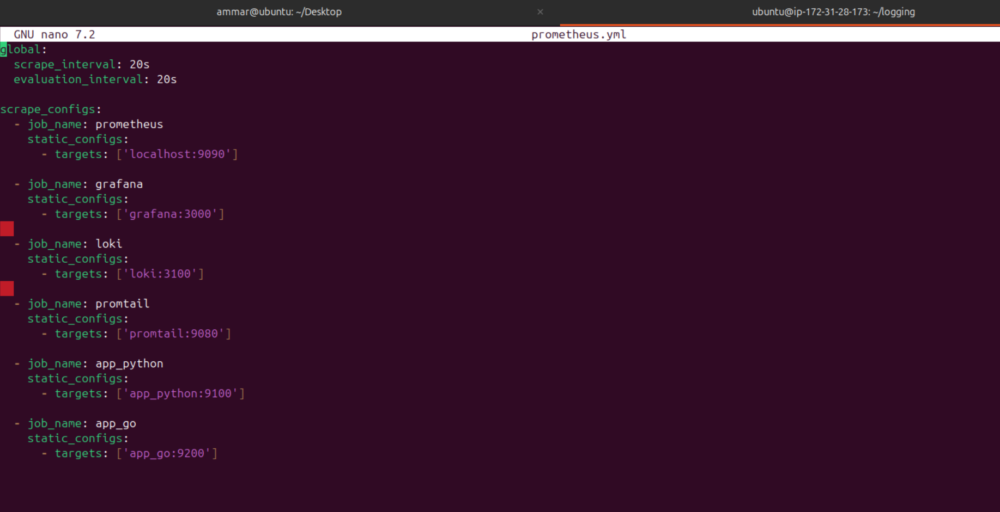
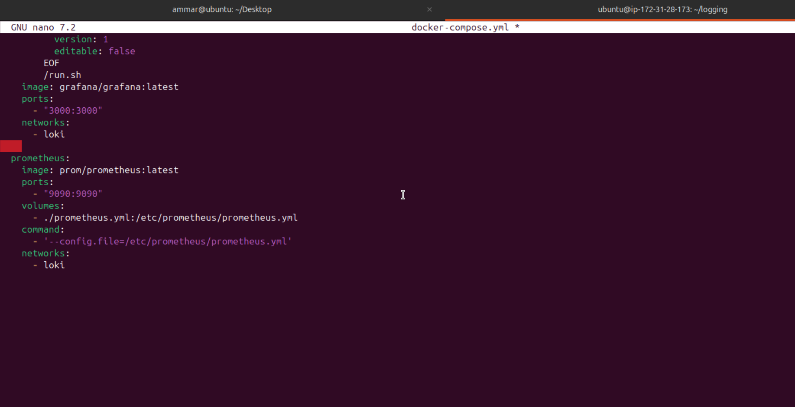
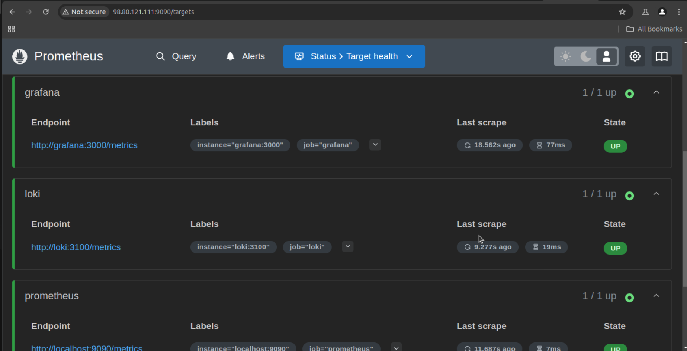
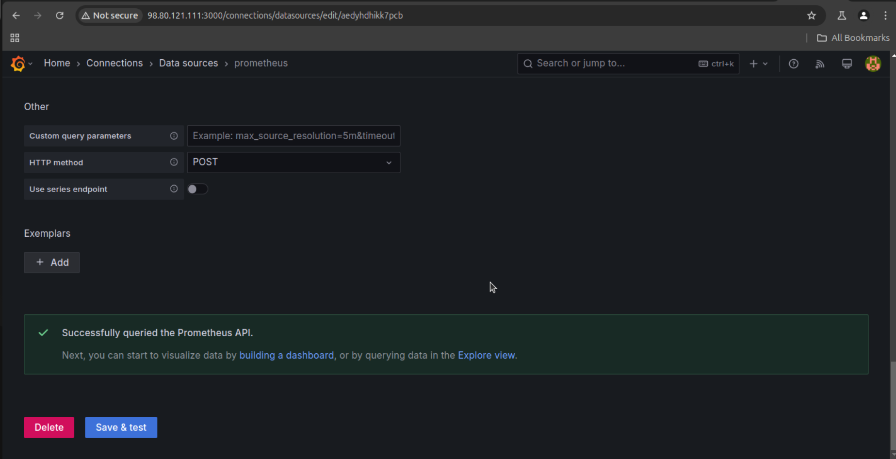
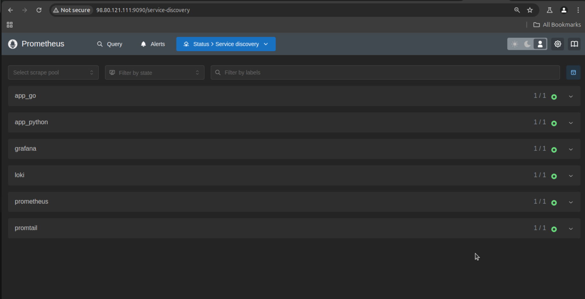
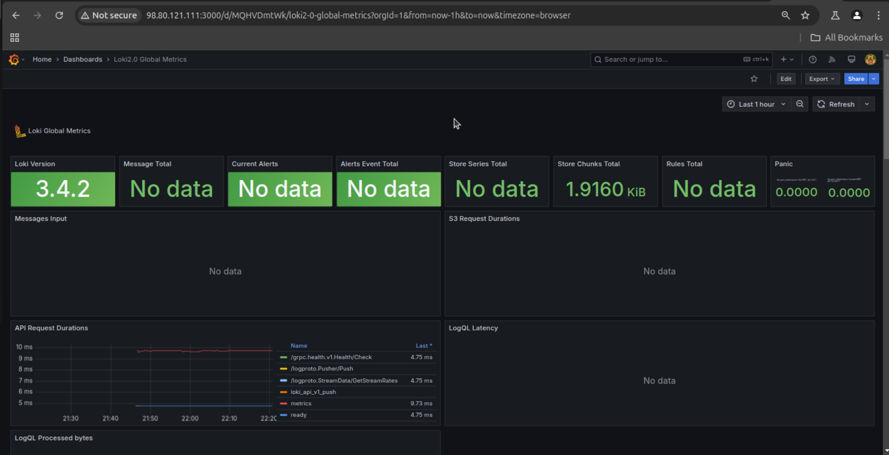

# Lab 8: Monitoring with Prometheus

- let's create `prometheus.yml` file:
- 
- let's update `docker-compose` file to include `prometheus` role:
- 
- let's start the stack, and acces `prometheus` at port 9090
- 
- now let's configure `Grafana` dashboard at port 3000 and add `prometheus` as a data source:
- 
- let's add log rotation, memory limits and health checks for `app_python`:

  ```
  logging:
        driver: "json-file"
        options:
          max-size: "100m"
          max-file: "10"
          tag: "{{.ImageName}}|{{.Name}}"
      mem_limit: "256m"
      healthcheck:
        test: ["CMD", "python3", "-c", "import http.client; conn = http.client.HTTPConnection('localhost', 9100); conn.request('GET', '/'); response = conn.getresponse(); exit(0) if response.status == 200 else exit(1)"]
        interval: 10s
        timeout: 10s
        retries: 3
        start_period: 30s
  ```
- let's add log rotation, memory limits and health checks for `app_go`:

  ```
  logging:
        driver: "json-file"
        options:
          max-size: "100m"
          max-file: "10"
          tag: "{{.ImageName}}|{{.Name}}"
      mem_limit: "256m"
      healthcheck:
        test: ["CMD", "curl", "-f", "http://0.0.0.0:9200/"]
        interval: 10s
        timeout: 10s
        retries: 3
        start_period: 40s

  ```
- let's add log rotation, memory limits and health checks for `loki`:

```
logging:
      driver: "json-file"
      options:
        max-size: "100m"
        max-file: "10"
        tag: "{{.ImageName}}|{{.Name}}"
    mem_limit: "1g"
    healthcheck:
      test: wget --spider -q http://localhost:3100/ready
      interval: 30s
      timeout: 30s
      retries: 3
```

- let's add log rotation, memory limits and health checks for `promtail`:

```
logging:
      driver: "json-file"
      options:
        max-size: "100m"
        max-file: "10"
        tag: "{{.ImageName}}|{{.Name}}"
    mem_limit: "512m"
    healthcheck:
      test: pgrep -f promtail
      interval: 30s
      timeout: 30s
      retries: 3
```

- let's add log rotation, memory limits and health checks for `grafana`:

```
logging:
      driver: "json-file"
      options:
        max-size: "100m"
        max-file: "10"
        tag: "{{.ImageName}}|{{.Name}}"
    mem_limit: "1g"
    healthcheck:
      test: ["CMD", "curl", "-f", "http://0.0.0.0:3000/"] 
      interval: 30s
      timeout: 30s
      retries: 3
```

- let's add memory limits and health checks for `prometheus`:

```
mem_limit: "1g"
    healthcheck:
      test: wget http://localhost:9090
      interval: 30s
      timeout: 30s
      retries: 3
```

- `prometheus` is configured to scrape metrics from the applications:

  ```
  global:
    scrape_interval: 20s
    evaluation_interval: 20s

  scrape_configs:
    - job_name: prometheus
      static_configs:
        - targets: ['localhost:9090']

    - job_name: grafana
      static_configs:
        - targets: ['grafana:3000']

    - job_name: loki
      static_configs:
        - targets: ['loki:3100']

    - job_name: promtail
      static_configs:
        - targets: ['promtail:9080']

    - job_name: app_python
      static_configs:
        - targets: ['app_python:9100']

    - job_name: app_go
      static_configs:
        - targets: ['app_go:9200']
  ```
- let's check that services are discoverable from `prometheus`:
- 
- let's import loki's dashboard
- 
- let's import prometheus's dashboard
- 
