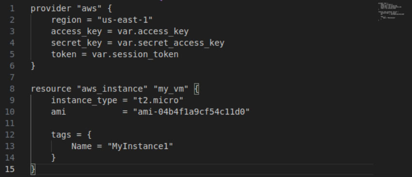

# Terraform

## Creating Docker Using Terraform

- output of terraform state list:


- output of terraform state show docker_container_nginx


- output of terraform state show docker_image_nginx


- let's check using the browser


- let's change the name of the port and use a variable for the name of the docker, and then apply the changes


- let's check the new port


- output of terraform output


## Creating VM Instance on AWS Using Terraform

- let's install awscli following the official documentaion https://docs.aws.amazon.com/cli/latest/userguide/getting-started-install.html

- let's configure aws profile


- let's create a new directory, then a new variables.tf file with our secret keys, then a new main.tf file within it with the following configurations


- let's check the plan


- let's apply and check the result using terraform show


- let's check the dashboard on AWS


- so everything is working exactly as it's supposed to be

## Creating Github Repo Using Terraform

- after creating a new directory, let's setup the main.tf


- let's initialize terraform


- let's check the plan


- let's apply and check our repo, it workes!


- let's import our repo into our configuration


- let's check the state of our terraform


- now let's change the description of the previous created repo, and apply the changes


- let's check it on github, the description got updated


## Creating Github Team Using Terraform

- let's create an organization on github


- let's define the provider and the repo


- let's create 3 different teams [admins, developers, viewers]


- let's define 3 different rules


- let's check the plan


- let's apply and check the repo


## Terraform Best Practices

This document highlights best practices applied in our Terraform setup for **AWS**, **Docker**, and **GitHub** infrastructure.

### 1. Provider Configuration Best Practices
- **Explicitly specify provider versions** to ensure compatibility and prevent breaking changes:
  ```hcl
  terraform {
    required_providers {
      github = {
        source  = "integrations/github"
        version = "~> 4.0"
      }
    }
  }
  ```
- **Use `var.token` for authentication** instead of hardcoding secrets.

### 2. Separation of Concerns
- AWS, Docker, and GitHub configurations are defined in separate Terraform blocks.
- Each module is **independent**, making debugging and maintenance easier.

### 3. Secure Handling of Credentials
- **AWS credentials are stored as Terraform variables** (`var.access_key`, `var.secret_access_key`, `var.session_token`).
- **GitHub token is passed using `var.token`**, avoiding hardcoded sensitive data.

### 4. Consistent Resource Naming
- Resources have clear, structured names (`github_repository.repo`, `aws_instance.my_vm`).
- Naming conventions improve **readability** and **predictability**.

### 5. Idempotency and State Management
- Terraform ensures that infrastructure matches the desired configuration.
- Running `terraform plan` before `terraform apply` prevents unintended changes.

### 6. Infrastructure as Code (IaC) Principles
- **Declarative approach:** Resources are defined explicitly.
- **Version-controlled:** Terraform files should be committed to a repository for tracking changes.

### 7. GitHub Repository and Branch Protections
- **Default branch is set explicitly** to `"main"`:
  ```hcl
  resource "github_branch_default" "main" {
    repository = github_repository.repo.name
    branch     = "main"
  }
  ```
- **Branch protection rules enforce security:**
  - Admin enforcement
  - Required PR reviews
  - Mandatory conversation resolution

### 8. Using Terraform to Manage Teams
- GitHub teams are defined in Terraform to enforce **role-based access control (RBAC)**.
- **Ensures consistent team permissions across repositories.**

### 9. Scalability and Reusability
- Modular structure allows easy **addition of new services** (e.g., more AWS instances, GitHub repositories, Docker containers).
- Variables (`var.container_name`) improve flexibility.

### 10. Docker Containerization
- Terraform manages **Docker images and containers**, ensuring consistency:
  ```hcl
  resource "docker_image" "nginx" {
    name         = "nginx:latest"
    keep_locally = false
  }
  ```
- Containers are easily deployed and version-controlled.

By following these best practices, our Terraform setup is **secure, scalable, and maintainable**. 🚀

